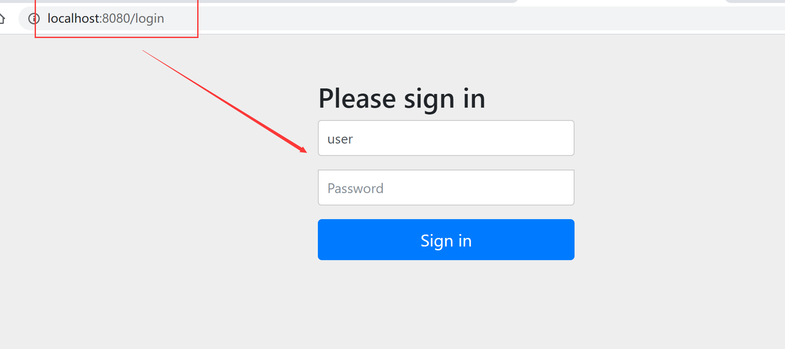

## SpringSecurity介绍


## 7.2Spring Security快速入门


1

```xml
 <dependency>
            <groupId>org.springframework.boot</groupId>
            <artifactId>spring-boot-starter-security</artifactId>
        </dependency>

        <dependency>
            <groupId>org.springframework.boot</groupId>
            <artifactId>spring-boot-starter-thymeleaf</artifactId>
        </dependency>
        <dependency>
            <groupId>org.springframework.boot</groupId>
            <artifactId>spring-boot-starter-web</artifactId>
        </dependency>
```


2



```
默认显示 登录界面，该界面是由spring security提供的
用户名  user
密码   启动项目时候，在控制台随机生成
```


## 7.3Mvc Security安全配置介绍


