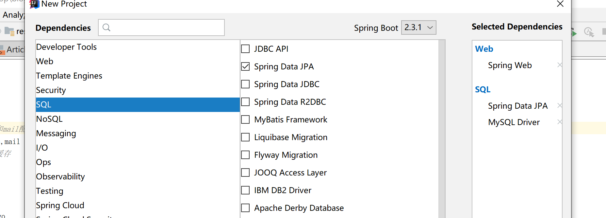

## 基础环境搭建


**创建项目**




<br>

**pom.xml**

```xml
<dependency>
            <groupId>org.springframework.boot</groupId>
            <artifactId>spring-boot-starter-data-jpa</artifactId>
        </dependency>

        <dependency>
            <groupId>org.springframework.boot</groupId>
            <artifactId>spring-boot-starter-web</artifactId>
        </dependency>

        <dependency>
            <groupId>org.springframework.boot</groupId>
            <artifactId>spring-boot-devtools</artifactId>
            <scope>runtime</scope>
            <optional>true</optional>
        </dependency>

        <dependency>
            <groupId>mysql</groupId>
            <artifactId>mysql-connector-java</artifactId>
            <scope>runtime</scope>
        </dependency>

        <dependency>
            <groupId>org.projectlombok</groupId>
            <artifactId>lombok</artifactId>
            <optional>true</optional>
        </dependency>
```


<br>

**配置文件配置**

```properties
#mysql数据库连接配置
spring:
  datasource:
    driver-class-name: com.mysql.cj.jdbc.Driver
    url: jdbc:mysql://localhost:3306/wukong_blog?serverTimezone=UTC&useUnicode=true&characterEncoding=utf8&autoReconnect=true
    username: root
    password: rootroot

 # 显示 sql 语句
  jpa:
    show-sql: true
```


**实体类**

```java
import lombok.AllArgsConstructor;
import lombok.Data;
import lombok.NoArgsConstructor;

import javax.persistence.*;

@Data
@NoArgsConstructor
@AllArgsConstructor
@Entity(name = "b_comment")
public class Comment {

    @Id
    @GeneratedValue(strategy = GenerationType.IDENTITY)
    private Integer id;

    @Column(name = "content")
    private String content;
    @Column(name = "author")
    private String author;
    @Column(name = "article_id")
    private Integer articleId;


}
```

<br>

**编写自定义仓库类，继承JpaRepository**

```java
package com.wukongnotnull.repository;
    /*
    author: 悟空非空也（B站/知乎/公众号）
    */
import com.wukongnotnull.domain.Comment;
import org.springframework.data.jpa.repository.JpaRepository;
import org.springframework.data.jpa.repository.Modifying;
import org.springframework.data.jpa.repository.Query;

import javax.transaction.Transactional;
import java.util.List;
import java.util.Optional;

public interface CommentRepository extends JpaRepository<Comment, Integer> {

    @Override
    List<Comment> findAll();

    @Override
    Optional<Comment> findById(Integer id);

    // 查询条件：作者不为空
    List<Comment> findByAuthorNotNull();


    @Override
    long count();

    @Override
    <S extends Comment> S saveAndFlush(S s);

    @Query("select c from b_comment c where c.articleId=?1")
    List<Comment> getCommentList(Integer articleId);

    @Query(value = "select * from b_comment c where c.article_id=?1",nativeQuery = true)
    List<Comment> getCommentList2(Integer articleId);

    @Transactional
    @Modifying
    @Query(value = "update b_comment set author =?1  where id =?2 ",nativeQuery = true)
    int updateComment(String author,Integer id);

    @Transactional
    @Modifying
    @Query(value = "delete from b_comment where id = ?1",nativeQuery = true)
    int deleteComment(Integer id);

    @Override
    <S extends Comment> S save(S entity);

}

```

<br>

**service层**

```java
package com.wukongnotnull.service;

import com.wukongnotnull.domain.Comment;

import java.util.Optional;

public interface CommentService {
    //add
    public Comment addComment(Comment comment);
    //delete
    public void deleteComment(Integer id);

    //modify
    public int modifyComment(Integer id,String author);
    //query
    public Comment findById(Integer id);
}

```


```java
package com.wukongnotnull.service;

import com.wukongnotnull.domain.Comment;
import com.wukongnotnull.repository.CommentRepository;
import org.springframework.beans.factory.annotation.Autowired;
import org.springframework.stereotype.Service;

import java.util.Optional;

@Service
public class CommentServiceImpl implements  CommentService {

    @Autowired
    public CommentRepository commentRepository;

    //add
    public Comment addComment(Comment comment){
        return this.commentRepository.save(comment);
    }
    //delete
    public void deleteComment(Integer id){
        this.commentRepository.deleteById(id);
    }

    //modify
    public int modifyComment(Integer id,String author){
        return this.commentRepository.updateComment(author,id);
    }
    //query
    public Comment findById(Integer id){
        Optional<Comment> optional = this.commentRepository.findById(id);
        if(optional.isPresent()){
           return optional.get();

        }
        return null;
    };
}

```

<br>

**controller层**

```java
package com.wukongnotnull.controller;

import com.wukongnotnull.domain.Comment;
import com.wukongnotnull.service.CommentService;
import org.springframework.beans.factory.annotation.Autowired;
import org.springframework.web.bind.annotation.GetMapping;
import org.springframework.web.bind.annotation.PathVariable;
import org.springframework.web.bind.annotation.RestController;

@RestController
public class CommentController {

    @Autowired
    private CommentService commentService;

    //query
    @GetMapping("/query/{id}")
    public Comment findById(@PathVariable("id") Integer id){
         return this.commentService.findById(id);
    }

    //modify
    @GetMapping("/modify/{id}/{author}")
    public int modifyBy(@PathVariable("id") Integer id,@PathVariable("author") String author){
        int i = this.commentService.modifyComment(id, author);
        return i;
    }

    //delete
    @GetMapping("/delete/{id}")
    public void deleteById(@PathVariable("id") Integer id){
        this.commentService.deleteComment(id);
    }

    //add

}

```

