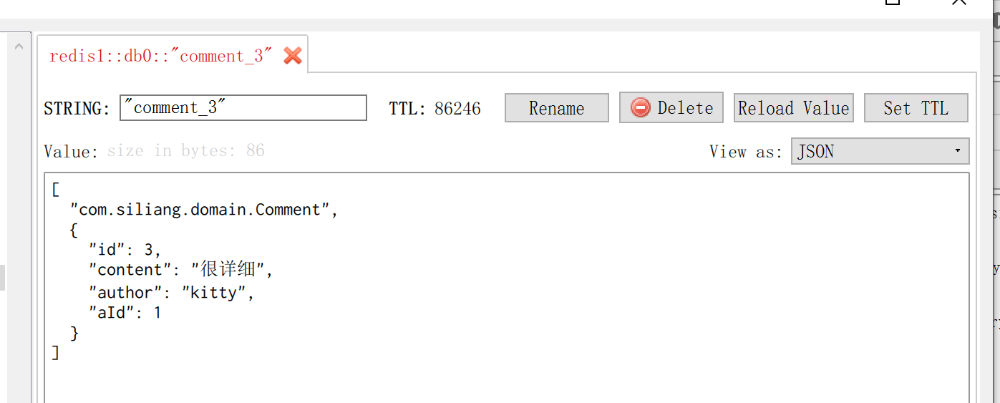

# Spring Boot 缓存注解介绍


## 基于注解的Redis缓存实现


pom中添加redis的依赖启动器

```xml
       <!--redis-->
        <dependency>
            <groupId>org.springframework.boot</groupId>
            <artifactId>spring-boot-starter-data-redis</artifactId>
        </dependency>
```


配置redis的连接配置

```xml
#redis数据库的连接配置
spring.redis.host=127.0.0.1
spring.redis.port=6379
spring.redis.password=
```


启动类上添加注解@EnableCache

```java
@SpringBootApplication
@EnableCaching//开启springboot默认缓存
public class RedisSprongbootApplication {

    public static void main(String[] args) {
        SpringApplication.run(RedisSprongbootApplication.class, args);
    }

}
```


service层上对删改查操作添加redis缓存注解

**增加功能直接插入mysql数据库**

```java
package com.wukongnotnull.service;

import com.wukongnotnull.domain.Comment;
import com.wukongnotnull.repository.CommentRepository;
import org.springframework.beans.factory.annotation.Autowired;
import org.springframework.cache.annotation.CacheEvict;
import org.springframework.cache.annotation.CachePut;
import org.springframework.cache.annotation.Cacheable;
import org.springframework.stereotype.Service;

import java.util.Optional;

@Service
public class CommentServiceImpl implements  CommentService {

    @Autowired
    public CommentRepository commentRepository;

    //add
    public Comment addComment(Comment comment){
        return this.commentRepository.save(comment);
    }

    //delete
    @CacheEvict(cacheNames = "comment")//删除使用@CacheEvict
    public void deleteComment(Integer id){
        this.commentRepository.deleteById(id);
    }

       //modify
    @CachePut(cacheNames = "comment",key ="#result.id")//更新使用，@CachePut,此处返回类型不能为int，因为缓存数据库中为int，再次查询需要的是Comment
/*    public int modifyComment(Integer id,String author){
        return this.commentRepository.updateComment(author,id);
    }*/
    public Comment modifyComment(Integer id,String author){//注意：key ="#result.id" 不是key ="#result"
        int i = this.commentRepository.updateComment(author, id);
        //再次查询操作,查询结果存入redis缓存中
       return this.findById(id);
    }

    //query
    @Cacheable(cacheNames = "comment",unless = "#result==null")//创建缓存空间，并命名为comment,如果查询结果为null，不存入该空间
    public Comment findById(Integer id){
        Optional<Comment> optional = this.commentRepository.findById(id);
        if(optional.isPresent()){
           return optional.get();

        }
        return null;
    };
}

```


实体类序列化


```java
@Entity(name = "t_comment")
public class Comment implements Serializable {
    @Id//注意导包 javax.persistence.Id
    @GeneratedValue(strategy = GenerationType.IDENTITY)
    private Integer id;
    private String content;
    private String author;
    @Column(name = "a_id")//实现映射
    private Integer aId;//此属性名和表中的字段a_id不一致，不能自动映射，需要在application.properties中进行配置
```


## 6.5基于API的Redis缓存实现

```java
@SpringBootApplication

public class RedisSprongbootApplication {

    public static void main(String[] args) {
        SpringApplication.run(RedisSprongbootApplication.class, args);
    }

}
```


实体类Comment

```java
package com.wukongnotnull.domain;

import javax.persistence.*;
import java.io.Serializable;

@Entity(name = "t_comment")
public class Comment implements Serializable {
    @Id//注意导包 javax.persistence.Id
    @GeneratedValue(strategy = GenerationType.IDENTITY)
    private Integer id;
    private String content;
    private String author;
    @Column(name = "a_id")//实现映射
    private Integer aId;//此属性名和表中的字段a_id不一致，不能自动映射，需要在application.properties中进行配置


    public Integer getId() {
        return id;
    }

    public void setId(Integer id) {
        this.id = id;
    }

    public String getContent() {
        return content;
    }

    public void setContent(String content) {
        this.content = content;
    }

    public String getAuthor() {
        return author;
    }

    public void setAuthor(String author) {
        this.author = author;
    }

    public Integer getaId() {
        return aId;
    }

    public void setaId(Integer aId) {
        this.aId = aId;
    }
}

```

repository:CommentRepository

```java
package com.wukongnotnull.repository;

import com.wukongnotnull.domain.Comment;
import org.springframework.data.jpa.repository.JpaRepository;
import org.springframework.data.jpa.repository.Modifying;
import org.springframework.data.jpa.repository.Query;
import org.springframework.transaction.annotation.Transactional;

//接口遵循jpa的规则
public interface CommentRepository extends JpaRepository<Comment,Integer> {

    //modify comment according id and author
    @Transactional//进行事务管理
    @Modifying
    @Query("update t_comment set author=?1 where id=?2")
    public int updateComment(String author,Integer id);


    
}

```


service: ApiCommentService

```java
package com.wukongnotnull.service;

import ch.qos.logback.core.util.TimeUtil;
import com.wukongnotnull.domain.Comment;
import com.wukongnotnull.repository.CommentRepository;
import org.springframework.beans.factory.annotation.Autowired;
import org.springframework.data.redis.core.RedisTemplate;
import org.springframework.stereotype.Service;
import org.springframework.transaction.annotation.Transactional;

import java.util.Optional;
import java.util.concurrent.TimeUnit;

@Service
@Transactional
public class ApiCommentService {

    @Autowired
    private CommentRepository commentRepository;

    @Autowired
    private RedisTemplate redisTemplate;

    /**
     * 查询方法
     */

    public Comment findById(Integer id){
        //先到缓存中查询
        Comment comment = (Comment) redisTemplate.opsForValue().get("comment_" + id);
        if(comment!=null){
            //缓存中有数据
            return  comment;
        }else{//缓存中没有数据
            //到数据库中进行查询
            Optional<Comment> byId = commentRepository.findById(id);
            if(byId.isPresent()){
                //若是数据库中存在，将数据先存入redis
                Comment comment1 = byId.get();
                redisTemplate.opsForValue().set("comment_"+id,comment1,1, TimeUnit.DAYS);
                return comment1;
            }
            System.out.println("缓存中没有数据的情况下，数据库中也没有");
            return null;
        }

    }
    /**
     * 更新方法
     */
    public Comment updateComment(Comment comment){
        //更新mysql数据库
        int i = commentRepository.updateComment(comment.getAuthor(), comment.getId());
        //更新redis缓存
        redisTemplate.opsForValue().set("comment_"+comment.getId(),comment);
        //更新后进行查询
      return   this.findById(comment.getId());

    }

    /**
     * 删除方法
     */
     public void deleteComment(Integer id){
         //删除数据库中的数据
         commentRepository.deleteById(id);
         //删除redis缓存中的数据
         redisTemplate.delete("comment_" + id);
     }


}

```


controller:ApiCommentController

```java
package com.wukongnotnull.controller;

import com.wukongnotnull.domain.Comment;
import com.wukongnotnull.service.ApiCommentService;
import org.springframework.beans.factory.annotation.Autowired;
import org.springframework.web.bind.annotation.GetMapping;
import org.springframework.web.bind.annotation.PathVariable;
import org.springframework.web.bind.annotation.RequestMapping;
import org.springframework.web.bind.annotation.RestController;

@RestController
@RequestMapping("/api")
public class ApiCommentController {

    @Autowired
    private ApiCommentService apiCommentService;

    //query
    @GetMapping("/query/{id}")
    public Comment findById(@PathVariable("id") Integer id){
         return this.apiCommentService.findById(id);
    }

    //modify
    @GetMapping("/modify/{id}/{author}")
    public Comment modifyBy(@PathVariable("id") Integer id,@PathVariable("author") String author){
        Comment comment = new Comment();
        comment.setId(id);
        comment.setAuthor(author);
        return this.apiCommentService.updateComment(comment);

    }

    //delete
    @GetMapping("/delete/{id}")
    public void deleteById(@PathVariable("id") Integer id){
        this.apiCommentService.deleteComment(id);
    }

    //add

}

```


## 6.6自定义RedisTemplate(基于api的缓存数据json格式化)

**痛点**

缓存管理的实体类使用的jdk序列化机制，缺点：不便于可视化


缓存中的数据进行json序列化

对基于api的redis缓存有效，注解无效

```java
package com.wukongnotnull.config;
import com.fasterxml.jackson.annotation.JsonAutoDetect;
import com.fasterxml.jackson.annotation.PropertyAccessor;
import com.fasterxml.jackson.databind.ObjectMapper;
import org.springframework.context.annotation.Bean;
import org.springframework.context.annotation.Configuration;
import org.springframework.data.redis.cache.RedisCacheConfiguration;
import org.springframework.data.redis.cache.RedisCacheManager;
import org.springframework.data.redis.connection.RedisConnectionFactory;
import org.springframework.data.redis.core.RedisTemplate;
import org.springframework.data.redis.serializer.Jackson2JsonRedisSerializer;
import org.springframework.data.redis.serializer.RedisSerializationContext;
import org.springframework.data.redis.serializer.RedisSerializer;
import org.springframework.data.redis.serializer.StringRedisSerializer;

import java.time.Duration;


@Configuration   // 定义一个配置类
public class RedisConfig {
    @Bean
    public RedisTemplate<Object, Object> redisTemplate(RedisConnectionFactory redisConnectionFactory) {
        RedisTemplate<Object, Object> template = new RedisTemplate();
        template.setConnectionFactory(redisConnectionFactory);
        // 使用JSON格式序列化对象，对缓存数据key和value进行转换
        Jackson2JsonRedisSerializer jacksonSeial = new Jackson2JsonRedisSerializer(Object.class);
        // 解决查询缓存转换异常的问题
        ObjectMapper om = new ObjectMapper();
        om.setVisibility(PropertyAccessor.ALL, JsonAutoDetect.Visibility.ANY);
        om.enableDefaultTyping(ObjectMapper.DefaultTyping.NON_FINAL);
        jacksonSeial.setObjectMapper(om);

        // 设置RedisTemplate模板API的序列化方式为JSON
        template.setDefaultSerializer(jacksonSeial);
        return template;
    }

   

```




## 自定义RedisCacheManager（基于注解的缓存数据的json格式化）


**基于注解的，基于api的无效，实体类可以删除ImplementSeriable 序列化**

```java
package com.wukongnotnull.config;


import com.fasterxml.jackson.annotation.JsonAutoDetect;
import com.fasterxml.jackson.annotation.PropertyAccessor;
import com.fasterxml.jackson.databind.ObjectMapper;
import org.springframework.context.annotation.Bean;
import org.springframework.context.annotation.Configuration;
import org.springframework.data.redis.cache.RedisCacheConfiguration;
import org.springframework.data.redis.cache.RedisCacheManager;
import org.springframework.data.redis.connection.RedisConnectionFactory;
import org.springframework.data.redis.core.RedisTemplate;
import org.springframework.data.redis.serializer.Jackson2JsonRedisSerializer;
import org.springframework.data.redis.serializer.RedisSerializationContext;
import org.springframework.data.redis.serializer.RedisSerializer;
import org.springframework.data.redis.serializer.StringRedisSerializer;

import java.time.Duration;

@Configuration//定义为配置类
public class RedisConfig {

    @Bean
    public RedisCacheManager cacheManager(RedisConnectionFactory redisConnectionFactory) {
        // 分别创建String和JSON格式序列化对象，对缓存数据key和value进行转换
        RedisSerializer<String> strSerializer = new StringRedisSerializer();
        Jackson2JsonRedisSerializer jacksonSeial =
                new Jackson2JsonRedisSerializer(Object.class);
        // 解决查询缓存转换异常的问题
        ObjectMapper om = new ObjectMapper();
        om.setVisibility(PropertyAccessor.ALL, JsonAutoDetect.Visibility.ANY);
        om.enableDefaultTyping(ObjectMapper.DefaultTyping.NON_FINAL);
        jacksonSeial.setObjectMapper(om);

        // 定制缓存数据序列化方式及时效
        RedisCacheConfiguration config = RedisCacheConfiguration.defaultCacheConfig()
                .entryTtl(Duration.ofDays(1))
                .serializeKeysWith(RedisSerializationContext.SerializationPair.fromSerializer(strSerializer))
                .serializeValuesWith(RedisSerializationContext.SerializationPair.fromSerializer(jacksonSeial))
                .disableCachingNullValues();

        RedisCacheManager cacheManager = RedisCacheManager.builder(redisConnectionFactory).cacheDefaults(config).build();
        return cacheManager;
    }
}

```


# 