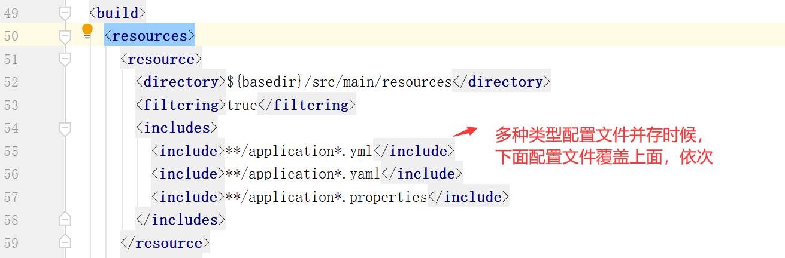

##  application.properties配置文件

**配置端口号**

```
#配置端口号
server.port=8090
#配置虚拟路径
server.servlet.context-path=/project-name
```


## application.yaml配置文件

```
#端口号 虚拟路径
server:
  port: 8091
  servlet:
    context-path: /project-name2
```


**注意**



