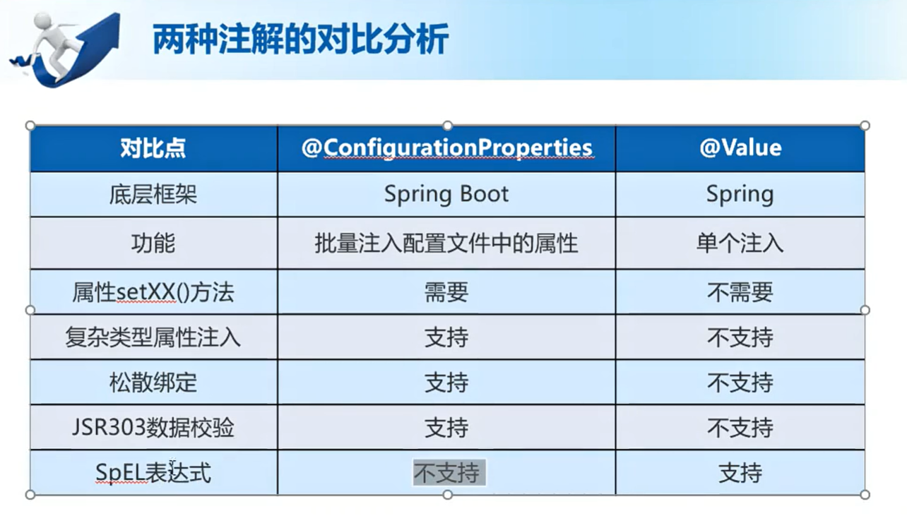

## 使用注解@ConfigurationProperties和@Value注入属性


第一种方法properties

```
#给属性赋值
person.id=2
person.name=xiaowang
person.hobby=eat,drink,play
person.family=father,mother
person.map.k1=v1
person.map.k2=v2
person.peter.peterName=wangcai
person.peter.peterAge=10

```


第二种方式yml

```
#给属性赋值
person:
  id: 1
  name: zhangsan
  hobby: [eat,drink,play]
  family:
    [baba,mama,gege,jiejie]
  map:
    {k1: v1,k2: v2}
  peter:
    {peterName: dog,peterAge: 2}

```


编写实体类,使用@Component,@ConfigurationProperties注解

```java
package com.wukongnotnull.myspringboot.domain;

import org.springframework.boot.context.properties.ConfigurationProperties;
import org.springframework.context.annotation.PropertySource;
import org.springframework.stereotype.Component;

import java.util.Arrays;
import java.util.List;
import java.util.Map;

/**
 * @Author: 悟空非空也（公众号/B站/知乎）
 */
@Component//生成当前类的实例对象，存到ioc容器中
@ConfigurationProperties(prefix = "person")//将配置文件中前缀为person的属性值映射到当前类的变量上
public class Person {

    private  int id;
    private  String name;
    private List hobby;
    private String[] family;
    private Map map;
    private Peter peter;

    public int getId() {
        return id;
    }

    public void setId(int id) {
        this.id = id;
    }

    public String getName() {
        return name;
    }

    public void setName(String name) {
        this.name = name;
    }

    public List getHobby() {
        return hobby;
    }

    public void setHobby(List hobby) {
        this.hobby = hobby;
    }

    public String[] getFamily() {
        return family;
    }

    public void setFamily(String[] family) {
        this.family = family;
    }

    public Map getMap() {
        return map;
    }

    public void setMap(Map map) {
        this.map = map;
    }

    public Peter getPeter() {
        return peter;
    }

    public void setPeter(Peter peter) {
        this.peter = peter;
    }

    @Override
    public String toString() {
        return "Person{" +
                "id=" + id +
                ", name='" + name + '\'' +
                ", hobby=" + hobby +
                ", family=" + Arrays.toString(family) +
                ", map=" + map +
                ", peter=" + peter +
                '}';
    }
}

```

```java
package com.wukongnotnullg.myspringboot.domain;

/**
 * @Author: 悟空非空也（公众号/B站/知乎）
 */
public class Peter {

    private String peterName;
    private int peterAge;

    public String getPeterName() {
        return peterName;
    }

    public void setPeterName(String peterName) {
        this.peterName = peterName;
    }

    public int getPeterAge() {
        return peterAge;
    }

    public void setPeterAge(int peterAge) {
        this.peterAge = peterAge;
    }

    @Override
    public String toString() {
        return "Peter{" +
                "peterName='" + peterName + '\'' +
                ", peterAge=" + peterAge +
                '}';
    }
}

```


测试类

```java
@SpringBootTest
class MySpringbootApplicationTests {

    @Autowired
    private  Person person;

    @Autowired
    private HelloController helloController;

    @Value(value = "${person.name}") //直接注入，不需要setter方法
    private String str;

    @Test
    public void contextLoads() {
        String hello = helloController.hello();
        System.out.println(hello);

    }

    @Test
    public void personTest(){

        System.out.println(person);
    }

    @Test
    public void strTest(){
        System.out.println("打印出str===》"+str);
    }
    
}
```


@Value直接注入属性

```prope
#给基本数据数据类型注入
str=jibenshujuleixing
```


测试

```java
@SpringBootTest
class MySpringbootApplicationTests {

    @Value(value = "${str}") //直接注入，不需要setter方法
    private String str;

    @Test
    public void strTest(){
        System.out.println("打印出str===》"+str);
    }

}
```


### @ConfigurationProperties注解支持JSR303数据校验


application.properties

```properties
#@ConfigurationProperties注解支持JSR303数据校验
user.email=139aaaa
```


实体类

```java
package com.wukongnotnullg.myspringboot.domain;

import org.springframework.boot.context.properties.ConfigurationProperties;
import org.springframework.stereotype.Component;
import org.springframework.validation.annotation.Validated;

import javax.validation.constraints.Email;

@Component
@ConfigurationProperties(prefix = "user")
@Validated
public class User {

    @Email
    private  String email;

    public String getEmail() {
        return email;
    }

    public void setEmail(String email) {
        this.email = email;
    }
}
```


pom

```pom
       <dependency>
            <groupId>org.springframework.boot</groupId>
            <artifactId>spring-boot-starter-validation</artifactId>
        </dependency>
```


test

```java
    @Test
    public void validateTest(){
        System.out.println(user.getEmail());
    }
```


## 两种注解对比分析



