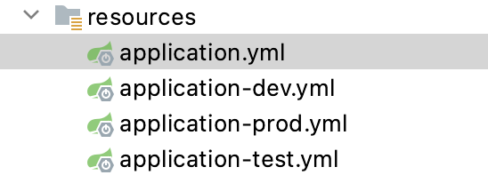

# profile 文件配置


多环境配置文件格式


## 方法一
<br>
使用命令行方式激活指定环境的配置文件


ctrl+c  服务器运行退出


ctrl+c  停止

<br>

## 方法二
在全局配置文件application.properties设置 spring.profiles.active属性激活

```properties
spring.profiles.active=test
```
<br>

### 案例 1 不同环境下使用不同端口

<br>

**创建不同环境下配置文件**



<br>

application.yml

```yaml
spring:
  profiles:
    active: test
```


application-dev.yml

```yaml
server:
  port: 8081
```


application-prod.yml

```yaml
server:
  port: 8082
```


application-test.yml

```yaml
server:
  port: 8083
```


<br>

**运行 main 方法，查看控制台的端口号输出信息**

<br>

### 案例 2 不同环境下使用不同数据库

**使用 @Profile 注解进行多环境配置**

<br>

编写不同环境下的配置类


<br>

```java
package com.wukongnotnull.config;
/* 
author: 悟空非空也（B站/知乎/公众号） 
*/

public interface DBConnector {

    /**
     *  对不同的环境下的数据库设置统一接口约束
     */
    void configuration();
}


```

```java

package com.wukongnotnull.config;/* 
author: 悟空非空也（B站/知乎/公众号） 
*/

import org.springframework.context.annotation.Configuration;
import org.springframework.context.annotation.Profile;

@Configuration
@Profile(value = "dev")
public class DevDBConnector  implements  DBConnector{


    @Override
    public void configuration() {
        System.out.println("开发环境下连接数据库。。。");
    }

}

```
<br>

```java
package com.wukongnotnull.config;
/* 
author: 悟空非空也（B站/知乎/公众号） 
*/

import org.springframework.context.annotation.Configuration;
import org.springframework.context.annotation.Profile;

@Configuration
@Profile(value = "pro")
public class ProDBConnector  implements  DBConnector{

    @Override
    public void configuration() {
        System.out.println("生产环境下连接数据库。。。。。");
    }
}
```

<br>

```java
package com.wukongnotnull.config;/* 
author: 悟空非空也（B站/知乎/公众号） 
*/

import org.springframework.context.annotation.Configuration;
import org.springframework.context.annotation.Profile;

@Configuration
@Profile(value = "test")
public class TestDBConnector implements  DBConnector{

    public void configuration() {
        System.out.println("测试环境下连接数据库。。。。");
    }
}


```

<br>

在全局配置文件application.properties中指定使用哪个环境

```properties

spring.profiles.active=test
#或者
#spring.profiles.active=pro
#或者
#spring .profiles.active=dev

```

<br>

测试

```java

    @Autowired
    private DBConnector dbConnector;

    @Test
    public void  dbConnectorTest(){
        dbConnector.configuration();
    }
```


<br>

<br>

<br>