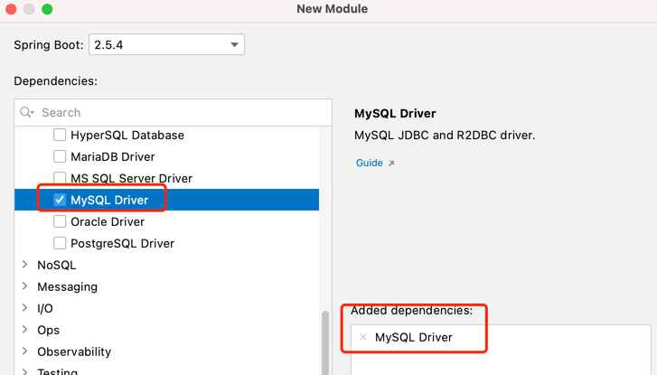

# 基础环境搭建


**创建数据库**

```sql
CREATE DATABASE wukong_blog;

USE wukong_blog;

CREATE TABLE `b_article` (
  `id` INT(20) NOT NULL AUTO_INCREMENT COMMENT '文章id',
  `title` VARCHAR(200) DEFAULT NULL COMMENT '文章标题',
  `content` LONGTEXT COMMENT '文章内容',
  PRIMARY KEY (`id`)
) ENGINE=INNODB DEFAULT CHARSET=utf8;

INSERT INTO `b_article` VALUES ('1', 'Spring Boot 青铜篇', '从入门到放弃讲解...');
INSERT INTO `b_article` VALUES ('2', 'Spring Cloud 王者篇', '从入门到入土讲解...');

  CREATE TABLE `b_comment` (
  `id` INT(20) NOT NULL AUTO_INCREMENT COMMENT '评论id',
  `content` LONGTEXT COMMENT '评论内容',
  `author` VARCHAR(200) DEFAULT NULL COMMENT '评论作者',
  `article_id` INT(20) DEFAULT NULL COMMENT '外键：文章id',
  PRIMARY KEY (`id`)
) ENGINE=INNODB  DEFAULT CHARSET=utf8;

INSERT INTO `b_comment` VALUES ('1', '赞1', 'wukong', '1');
INSERT INTO `b_comment` VALUES ('2', '赞2', 'zhubajie', '1');
INSERT INTO `b_comment` VALUES ('3', '赞3', 'tangseng', '1');
INSERT INTO `b_comment` VALUES ('4', '赞4', 'bailongma', '2');
INSERT INTO `b_comment` VALUES ('5', '赞5', 'baigujing', '2');

```


<br>

**创建项目,引入mysql的依赖启动器**



 

<br>

**创建实体类domain**

> 推荐实体类使用  lombok  插件，编译后自动生成 setter | getter 方法。

```java
package com.wukongnotnull.domain;
/* 
author: 悟空非空也（B站/知乎/公众号） 
*/

import lombok.AllArgsConstructor;
import lombok.Data;
import lombok.NoArgsConstructor;
import lombok.ToString;

@Data
@NoArgsConstructor
@AllArgsConstructor
public class Article {

    private Integer id;
    private String title;
    private String content;


}


```

```java
package com.wukongnotnull.domain;
  /* 
  author: 悟空非空也（B站/知乎/公众号） 
  */

import lombok.AllArgsConstructor;
import lombok.Data;
import lombok.NoArgsConstructor;
import lombok.ToString;

@Data
@NoArgsConstructor
@AllArgsConstructor
public class Comment {

    private Integer id;
    private String content;
    private String author;
    //此属性名和表中的字段article_id不一致，不能自动映射，需要在application.yml中进行配置
    //mybatis.configuration.map-underscore-to-camel-case=true
    private Integer articleId;


}

```

<br>

**全局配置文件进行数据库连接配置**<br>

application.yml

```xml
spring:
  datasource:
    url: jdbc:mysql://localhost:3306/wukong_blog?serverTimezone=UTC&useUnicode=true&characterEncoding=utf8&autoReconnect=true
    driver-class-name: com.mysql.cj.jdbc.Driver
    username: root
    password: rootroot
```

<br>

**使用第三方数据源进行配置（推荐：ali的druid数据源为例）**

pom.xml

```xml
<dependency>
    <groupId>com.alibaba</groupId>
    <artifactId>druid-spring-boot-starter</artifactId>
    <version>1.1.22</version>
</dependency>

```

<br>

**在全局配置文件中设置druid的属性**

<br>

application.yml

```yaml
spring:
  datasource:
    type: com.alibaba.druid.pool.DruidDataSource
    initialSize: 30
    minIdle: 20
    maxActive: 200
```


<br>

<br>

<br>

