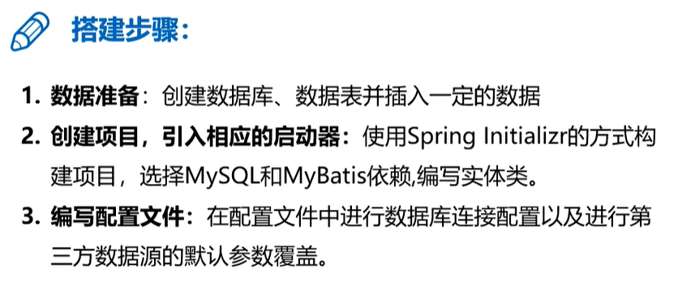

## 基础环境搭建




创建数据库

```sql
CREATE DATABASE springbootdata;

USE springbootdata;

CREATE TABLE `t_article` (
  `id` INT(20) NOT NULL AUTO_INCREMENT COMMENT '文章id',
  `title` VARCHAR(200) DEFAULT NULL COMMENT '文章标题',
  `content` LONGTEXT COMMENT '文章内容',
  PRIMARY KEY (`id`)
) ENGINE=INNODB AUTO_INCREMENT=2 DEFAULT CHARSET=utf8;

INSERT INTO `t_article` VALUES ('1', 'Spring Boot基础入门', '从入门到精通讲解...');
INSERT INTO `t_article` VALUES ('2', 'Spring Cloud基础入门', '从入门到精通讲解...');

  CREATE TABLE `t_comment` (
  `id` INT(20) NOT NULL AUTO_INCREMENT COMMENT '评论id',
  `content` LONGTEXT COMMENT '评论内容',
  `author` VARCHAR(200) DEFAULT NULL COMMENT '评论作者',
  `a_id` INT(20) DEFAULT NULL COMMENT '关联的文章id',
  PRIMARY KEY (`id`)
) ENGINE=INNODB AUTO_INCREMENT=3 DEFAULT CHARSET=utf8;

INSERT INTO `t_comment` VALUES ('1', '很全、很详细', '鲁迅', '1');
INSERT INTO `t_comment` VALUES ('2', '赞一个', 'tom', '1');
INSERT INTO `t_comment` VALUES ('3', '很详细', 'kitty', '1');
INSERT INTO `t_comment` VALUES ('4', '很好，非常详细', '张三', '1');
INSERT INTO `t_comment` VALUES ('5', '很不错', '李四', '2');

```


创建项目，引入mysql和mybatis的依赖启动器


创建实体类domain

```java
package com.wukongnotnul.myspringbootmybatis.domain;

import java.util.List;

public class Article {

    private Integer id;
    private String title;
    private String content;

    //额外增加一个字段 评论集合
    private List<Comment> commentList;

    public Integer getId() {
        return id;
    }

    public void setId(Integer id) {
        this.id = id;
    }

    public String getTitle() {
        return title;
    }

    public void setTitle(String title) {
        this.title = title;
    }

    public String getContent() {
        return content;
    }

    public void setContent(String content) {
        this.content = content;
    }

    public List<Comment> getCommentList() {
        return commentList;
    }

    public void setCommentList(List<Comment> commentList) {
        this.commentList = commentList;
    }
}

```

```java
package com.wukongnotnull.myspringbootmybatis.domain;

public class Comment {

    private Integer id;
    private String content;
    private String author;
    private Integer aId;//此属性名和表中的字段a_id不一致，不能自动映射，需要在application.properties中进行配置
mybatis.configuration.map-underscore-to-camel-case=true

    public Integer getId() {
        return id;
    }

    public void setId(Integer id) {
        this.id = id;
    }

    public String getContent() {
        return content;
    }

    public void setContent(String content) {
        this.content = content;
    }

    public String getAuthor() {
        return author;
    }

    public void setAuthor(String author) {
        this.author = author;
    }

    public Integer getaId() {
        return aId;
    }

    public void setaId(Integer aId) {
        this.aId = aId;
    }
}

```


全局配置文件进行数据库连接配置

```xml
spring.datasource.driver-class-name=com.mysql.jdbc.Driver
spring.datasource.url=jdbc:mysql://localhost:3306/springbootdata?serverTimezone=UTC
spring.datasource.username=root
spring.datasource.password=root

```


设置数据源类型配置（ali的druid数据源为例）

```xml
<dependency>
    <groupId>com.alibaba</groupId>
    <artifactId>druid-spring-boot-starter</artifactId>
    <version>1.1.22</version>
</dependency>

```


在全局配置文件中设置druid的属性

```xml
spring.datasource.type = com.alibaba.druid.pool.DruidDataSource
spring.datasource.initialSize=20
spring.datasource.minIdle=10
spring.datasource.maxActive=100

```


