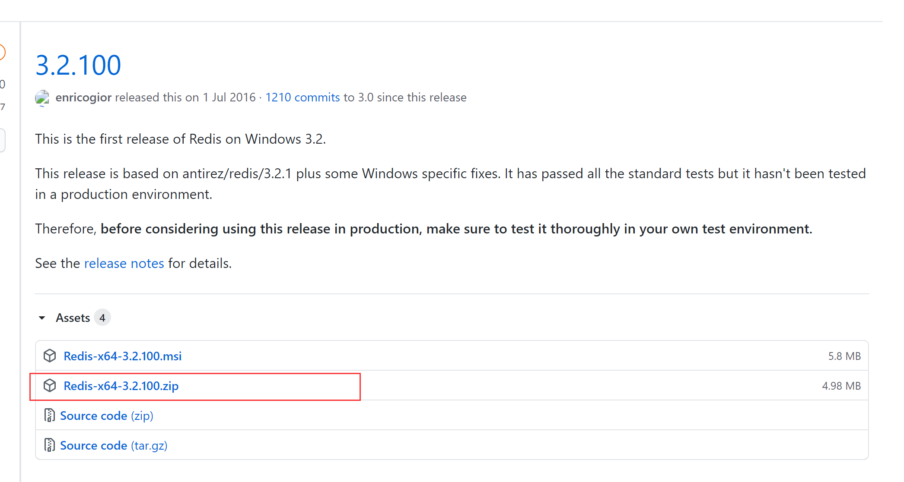

# Spring Boot 整合 Redis

## Redis介绍

**什么是Redis**

Redis 是一个开源（BSD许可）的、内存中的数据结构存储系统，它可以用作数据库、缓存和消息中间件，并提供多种语言的API。

**优点**

1.存取速度快：Redis速度非常快，每秒可执行大约110000次的设值操作，或者执行81000次的读取操作。

2.支持丰富的数据类型：Redis支持开发人员常用的大多数数据类型，例如列表、集合、排序集和散列等。

3.操作具有原子性：所有Redis操作都是原子操作，这确保如果两个客户端并发访问，Redis服务器能接收更新后的值。

4.提供多种功能：Redis提供了多种功能特性，可用作非关系型数据库、缓存中间件、消息中间件等。

<br>

# Redis下载与安装

**下载路径**

https://github.com/microsoftarchive/redis/releases/tag/win-3.2.100



<br>

**解压后放入磁盘某位置就安装成功（免安装）**

<br>

**安装可视化客户端**


<br>

## 使用Spring Boot整合Redis

1.在pom文件中添加Spring Data Redis依赖启动器

```properties
<dependency>
	<groupId>org.springframework.boot</groupId>
	<artifactId>spring-boot-starter-data-redis</artifactId>
</dependency>

```

<br>

2.在全局配置文件application.properties中添加Redis数据库连接配置

```properties
spring:
  redis:
    host: 127.0.0.1
    port: 6379
    password:

```

<br>

3.编写实体类

```java
package com.wukongnotnull.domain;/* 
author: 悟空非空也（B站/知乎/公众号） 
*/

import lombok.Data;
import org.springframework.data.annotation.Id;
import org.springframework.data.redis.core.RedisHash;
import org.springframework.data.redis.core.index.Indexed;

import java.util.List;

@Data
@RedisHash(value = "people")
public class Person {

    @Id
    private  String id;
    @Indexed
    private  String firstName;
    @Indexed
    private  String lastName;
    private  Address address;
    private List<Family> familyList;
}

```

```java
package com.wukongnotnull.domain;/* 
author: 悟空非空也（B站/知乎/公众号） 
*/

import lombok.Data;
import org.springframework.data.redis.core.index.Indexed;

@Data
public class Address {

    @Indexed
    private  String nation;
    @Indexed
    private  String village;

}
```

```java
package com.wukongnotnull.domain;/* 
author: 悟空非空也（B站/知乎/公众号） 
*/

import lombok.Data;
import org.springframework.data.redis.core.index.Indexed;

@Data
public class Family {

    @Indexed
    private String   type;

    @Indexed
    private String   name;


}

```

<br>

4.编写Repository接口

```java
package com.wukongnotnull.repository;/* 
author: 悟空非空也（B站/知乎/公众号） 
*/

import com.wukongnotnull.domain.Person;
import org.springframework.data.repository.CrudRepository;

public interface PersonRepository extends CrudRepository<Person,String> {

    Person findPersonByFirstName(String firstName);

    @Override
    <S extends Person> S save(S entity);

}

```

<br>

5.编写单元测试进行接口方法测试以及整合测试

```java
 package com.wukongnotnull.repository;

import com.wukongnotnull.domain.Address;
import com.wukongnotnull.domain.Family;
import com.wukongnotnull.domain.Person;
import org.junit.jupiter.api.Test;
import org.springframework.beans.factory.annotation.Autowired;
import org.springframework.boot.test.context.SpringBootTest;

import java.util.ArrayList;
import java.util.List;

/*
author: 悟空非空也（B站/知乎/公众号） 
*/
@SpringBootTest
class PersonRepositoryTest {

    @Autowired
    private  PersonRepository personRepository;

    @Test
    void findPersonByFirstName() {
        System.out.println(personRepository.findPersonByFirstName("空"));
    }

    @Test
    void save() {
        Person person = new Person();
        person.setId("002");
        person.setLastName("悟");
        person.setFirstName("空");

        Address address = new Address();
        address.setNation("中国");
        address.setVillage("南京");
        person.setAddress(address);

        List<Family> familyList = new ArrayList<>();
        Family father = new Family();
        father.setType("father");
        father.setName("杨康");
        Family mother = new Family();
        mother.setType("mother");
        mother.setName("穆念慈");
        familyList.add(father);
        familyList.add(mother);
        person.setFamilyList(familyList);

        System.out.println(personRepository.save(person));
    }
}

```


<br>

<br>

<br>