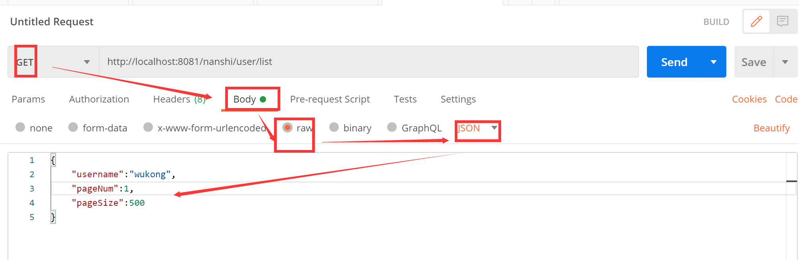

<extoc></extoc>

# 用户模块管理
## 集成mybatis

> springboot 2.x 默认数据源是  Hikari

引入坐标

```xml
 <parent>
    <groupId>org.springframework.boot</groupId>
    <artifactId>spring-boot-starter-parent</artifactId>
    <version>2.4.2</version>
  </parent>

  <dependencies>
    <dependency>
      <groupId>org.springframework.boot</groupId>
      <artifactId>spring-boot-starter-web</artifactId>
    </dependency>

    <dependency>
      <groupId>org.mybatis.spring.boot</groupId>
      <artifactId>mybatis-spring-boot-starter</artifactId>
      <version>2.1.4</version>
    </dependency>

    <dependency>
      <groupId>com.github.pagehelper</groupId>
      <artifactId>pagehelper-spring-boot-starter</artifactId>
      <version>1.2.13</version>
    </dependency>

    <dependency>
      <groupId>mysql</groupId>
      <artifactId>mysql-connector-java</artifactId>
    </dependency>
</dependencies>
```


**application.yml**

```java
# sb2.x 默认数据源Hikari配置
spring:
  datasource:
    url: jdbc:mysql://localhost:3306/test?useUnicode=true&characterEncoding=utf8&serverTimezone=GMT%2B8
    username: root
    password: root
    driver-class-name: com.mysql.cj.jdbc.Driver


# mybatis 配置
mybatis:
  mapper-locations: classpath:/mappers/*.xml
  configuration:
    map-underscore-to-camel-case: true
  type-aliases-package: com.wukong.pojo

#分页插件配置
pagehelper:
  helper-dialect: mysql

```


**启动类**

```java
@SpringBootApplication
// dao 无 bean对象，使用 @MapperScan 进行扫描
@MapperScan("com.wukong.dao")
public class App
{
    public static void main( String[] args )
    {
        SpringApplication.run(App.class);
        System.out.println( "Hello World!" );
    }
}
```


### 需求： 根据用户名查询指定用户

>  user表中 id 和 username 都要求唯一性

**dao 层接口**

com.wukong.dao.UserMapper

```jaa
package com.wukong.dao;

import com.wukong.pojo.User;


public interface UserMapper {

    public User getUserByUsername(String username);
}

```

**sql映射文件        resources/mappers/UserMapper.xml**

```xml
<?xml version="1.0" encoding="UTF-8" ?>
<!DOCTYPE mapper PUBLIC "-//mybatis.org//DTD Mapper 3.0//EN" "http://mybatis.org/dtd/mybatis-3-mapper.dtd" >
<mapper namespace="com.wukong.dao.UserMapper">
    <select id="getUserByUsername" parameterType="string" resultType="com.wukong.pojo.User">
        select *
        from user
        where  username = #{username}
    </select>
</mapper>

```


**service**

```java
public interface UserService {

    public User getUserByUsername(String username);
}

------------分割线------------------
  
  @Service
public class UserServiceImpl implements UserService {

    @Autowired
    private UserMapper userMapper;

    @Override
    public User getUserByUsername(String username) {
        return this.userMapper.getUserByUsername(username);
    }

}
```


**controller**

```java
@RestController
public class UserController {

    @Autowired
    private UserService userService;

    @GetMapping("/user/{username}")
    public User getUserByUsername(@PathVariable  String username){
        return this.userService.getUserByUsername(username);
    }

}
```


### 需求： 根据id查询指定用户

>  上述需求和本需求都是get请求方式，要留意请求路径的区分，不然会报错

**controller**

```java
@RestController
@RequestMapping("/user")
public class UserController {

    @Autowired
    private UserService userService;

    @GetMapping("/{username}")
    public User getUserByUsername(@PathVariable  String username){
        return this.userService.getUserByUsername(username);
    }

  	// 可以多添加 id 路径字段 区分  
    @GetMapping("/id/{id}")
    public Object getUserById(@PathVariable Integer id){
        return this.userService.getUserById(id);
    }
}
```


### 需求： 添加用户

> 要求：
>
> 添加用户字段 非空
>
> 用户名不能重复


**引入坐标**

```xml
    <!-- 实现字段的非空判断-->
    <dependency>
      <groupId>org.apache.commons</groupId>
      <artifactId>commons-lang3</artifactId>
    </dependency>


```


**工具类**

> ParamsException  作用： 自定义异常，遇到字段为空，用户名重复等属性错误时，抛出异常。

```java
package com.wukong.utils;

/**
 * author: 悟空非空也（B站/知乎/公众号）
 */

public class ParamsException extends RuntimeException {

    private Integer code = 300;
    private String msg = "默认参数异常提示";

    public ParamsException(){
        super();
    }

    public ParamsException(Integer code){
        this.code = code;
    }

    public ParamsException(String msg) {
        this.msg = msg;
    }

    public  ParamsException(Integer code, String msg) {
        this.code = code;
        this.msg = msg;
    }

    public Integer getCode() {
        return code;
    }

    public void setCode(Integer code) {
        this.code = code;
    }

    public String getMsg() {
        return msg;
    }

    public void setMsg(String msg) {
        this.msg = msg;
    }
}

```


> AssertUtil   提示语工具类，用于显示不同情况下，返回不同的提示语

```java
package com.wukong.utils;

/**
 * author: 悟空非空也（B站/知乎/公众号）
 */

/**
 *  提示语工具类
 */
public class AssertUtil {

    public static void isTrue(boolean flag, Integer code, String message)  {
        if (flag) {
            throw new ParamsException(code, message);
        }
        System.out.println();
    }

}

```


**dao & sql 映射文件**

```java
public interface UserMapper {

    public int addUser(User user);
}
```

```xml
    <insert id="addUser" parameterType="User">
        insert into user (username, password)
        values (#{username}, #{password})
    </insert>
```


**service**

```java
   public  void  addUser(User user);
```

```java
    /**
     *  字段非空判断
     *  username 不能重复
     */
    public void addUser(User user) {
        AssertUtil.isTrue(StringUtils.isBlank(user.getUsername()),301,"用户名为空，请重新输入");
        AssertUtil.isTrue(StringUtils.isBlank(user.getPassword()),302,"密码为空，请重新输入");

        AssertUtil.isTrue(userMapper.getUserByUsername(user.getUsername()) !=null,303,"用户名重复，请重新输入");

        int i = userMapper.addUser(user);
        AssertUtil.isTrue(i < 1, 303,"添加用户失败");
        AssertUtil.isTrue(i == 1, 200, "添加用户成功");

    }
```


**vo/ResultInfo**

> 响应给视图层的数据，进行自定义封装。

```java
package com.wukong.vo;
/* author: 悟空非空也（B站/知乎/公众号） */


public class ResultInfo {

    private Integer code = 200;
    private  String msg = "操作成功";
    private  Object data;

    public Integer getCode() {
        return code;
    }

    public void setCode(Integer code) {
        this.code = code;
    }

    public String getMsg() {
        return msg;
    }

    public void setMsg(String msg) {
        this.msg = msg;
    }

    public Object getData() {
        return data;
    }

    public void setData(Object data) {
        this.data = data;
    }
}
```


**controller**

```java
 @PostMapping("/user")
    public Object addUser(@RequestBody User user){
       ResultInfo resultInfo = new ResultInfo();
       try{
            this.userService.addUser(user);

        }catch (ParamsException paramsException){

           resultInfo.setCode(paramsException.getCode());
           resultInfo.setMsg(paramsException.getMsg());

        }catch (Exception e){
            e.printStackTrace();
        }

      return resultInfo;
   }
```


**postman 进行测试**


### 需求： 修改用户

> 要求： 
>
> id字段 不能为空。
>
> username 字段  修改后的新名字，可以同原名，但是不能同其他用户信息的用户名。同时，字段不能为空。
>
> password 不能为空。


**dao & sql 映射文件**

```java
 public int modifyUser(User user);
```

```xml
    <update id="modifyUser" parameterType="User">
        update user
        set username = #{username}, password = #{password}
        where id = #{id}
    </update>
```


**service**

```java
 public void modifyUser(User user);

```

```java
@Override
    public void modifyUser(User user) {
        //非空判断
        AssertUtil.isTrue(StringUtils.isBlank(user.getUsername()),301,"用户名为空，请重新输入");
        AssertUtil.isTrue(StringUtils.isBlank(user.getPassword()),302,"密码为空，请重新输入");
        AssertUtil.isTrue(user.getId() == null,305,"用户id为空");
        //username 不能已存在，除了自己
        User userByUsername = this.userMapper.getUserByUsername(user.getUsername());
        AssertUtil.isTrue(userByUsername != null && !user.getId().equals(userByUsername.getId()),303,"用户名重复，请重新输入");
        //修改用户信息
        int i = userMapper.modifyUser(user);
        AssertUtil.isTrue(i < 1,304,"用户修改失败");
     
    }
```


**controller**

```java
   @PutMapping("/user")
    public Object modifyUser(@RequestBody User user){
       ResultInfo resultInfo = new ResultInfo();
       try {
           this.userService.modifyUser(user);
       } catch (ParamsException e){
          resultInfo.setCode(e.getCode());
          resultInfo.setMsg(e.getMsg());
       }
       catch (Exception e) {
           e.printStackTrace();
       }
       return  resultInfo;
   }
```


### 需求： 删除用户

**dao & sql 映射语句**

```xml
  public  int deleteUser(Integer id);
```

```xml
    <delete id="deleteUser" parameterType="int">
        delete from user
        where id = #{id}
    </delete>
```


**service**

```java
    public void deleteUser(Integer id) {
        //非空判断
        AssertUtil.isTrue(id == null,305,"用户id为空");

        //是否存在该用户
        this.getUserById(id);

        //删除用户
        int i = this.userMapper.deleteUser(id);
        AssertUtil.isTrue(i < 1,304, "删除用户失败");
     

    }
```


**controller**

```java
   @DeleteMapping("/user/{id}")
    public Object deleteUser(@PathVariable Integer id) {
       ResultInfo resultInfo = new ResultInfo();
       try {
           this.userService.deleteUser(id);
       } catch (ParamsException e){
           resultInfo.setCode(e.getCode());
           resultInfo.setMsg(e.getMsg());
       }
       catch (Exception e) {
           e.printStackTrace();
       }
       return resultInfo;
   }
```


### 需求： 查询用户分页列表

**坐标**

```xml
    <dependency>
      <groupId>com.github.pagehelper</groupId>
      <artifactId>pagehelper-spring-boot-starter</artifactId>
      <version>1.2.13</version>
    </dependency>
```


**application.yml**

```yaml
#分页插件配置
pagehelper:
  helper-dialect: mysql
```


**bo/UserParams 实体类**

```java
package com.wukong.bo;
/* author: 悟空非空也（B站/知乎/公众号） */


public class UserParams {

    private  Integer pageNum = 1; //当前页
    private  Integer pageSize = 3; //页容量（每页包含多少记录）
    private  String username;

    public Integer getPageNum() {
        return pageNum;
    }

    public void setPageNum(Integer pageNum) {
        this.pageNum = pageNum;
    }

    public Integer getPageSize() {
        return pageSize;
    }

    public void setPageSize(Integer pageSize) {
        this.pageSize = pageSize;
    }

    public String getUsername() {
        return username;
    }

    public void setUsername(String username) {
        this.username = username;
    }
}

```


**dao  & sql 映射文件**

```java
  public List<User> getUserList(UserParams userParams);
```

```xml
    <select id="getUserList" parameterType="com.wukong.bo.UserParams" resultType="User">
        select *
        from user
        <where>
            <if test="username != null and username != ''">
               and username like CONCAT('%',#{username},'%')
            </if>
        </where>
    </select>
```


**service**

```java
    public PageInfo<User> getUserPageList(UserParams userParams);
```

```java
    public PageInfo<User> getUserPageList(UserParams userParams) {

        PageHelper.startPage(userParams.getPageNum(), userParams.getPageSize());

        return new PageInfo<User>(this.userMapper.getUserList(userParams));
    }
```


**controller**

```java
@GetMapping("/user/list")
public PageInfo<User> getUserPageList(@RequestBody UserParams userParams){
    return this.userService.getUserPageList(userParams);
}
```


**postman 测试**



