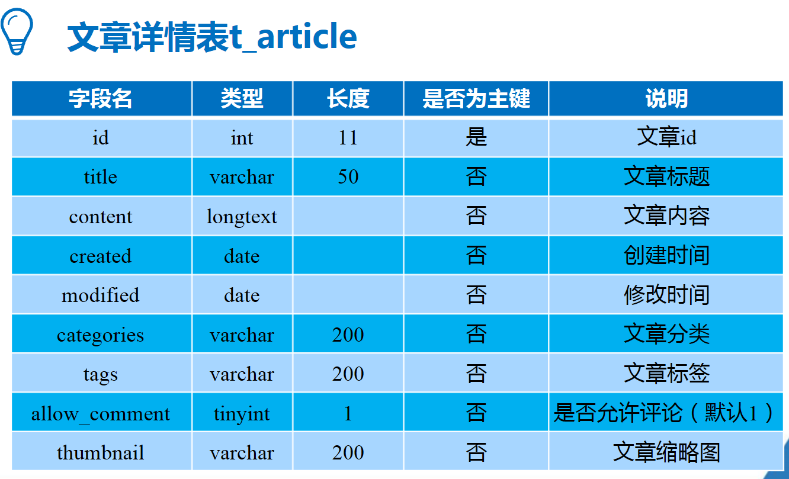
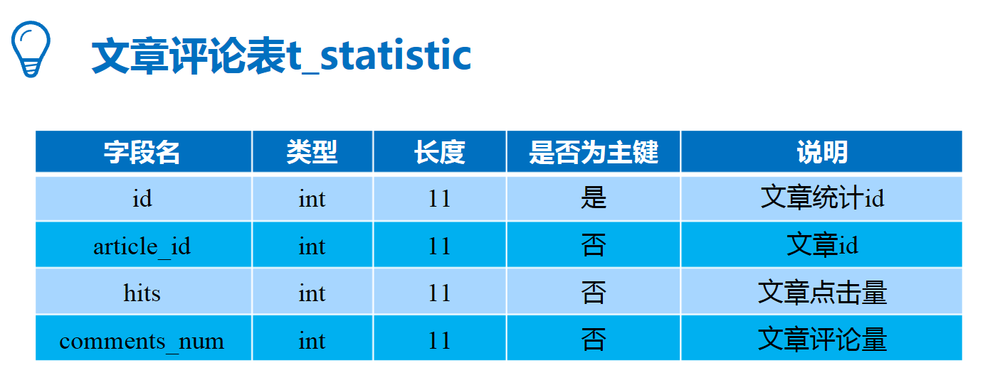
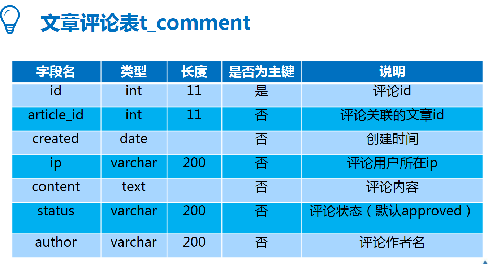
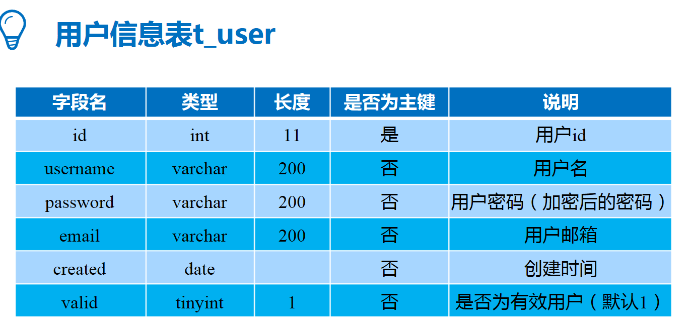
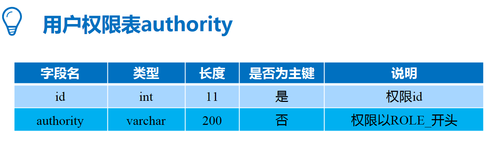
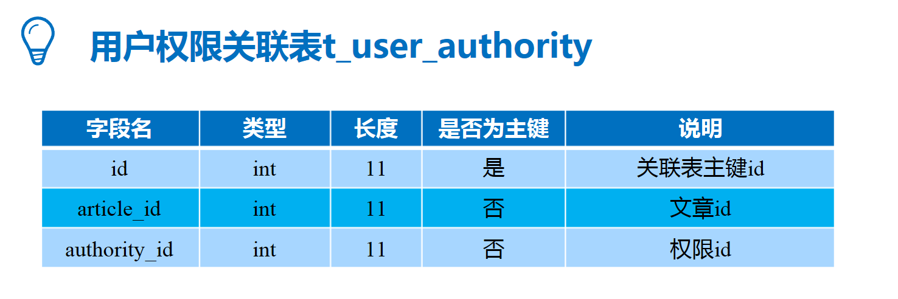

# Spring Boot综合项目实战

## 10.1系统概述

## 10.2系统开发及运行环境

## 10.3文件组织结构

## 10.4数据库设计

## 10.5系统环境搭建

## 10.6文章分页展示

## 10.7文章详情查看

## 10.8文章评论管理

## 10.9数据展示

## 10.10文章发布

## 10.11文章修改

## 10.12文章删除

## 10.13用户登录控制

## 10.14定时邮件发送