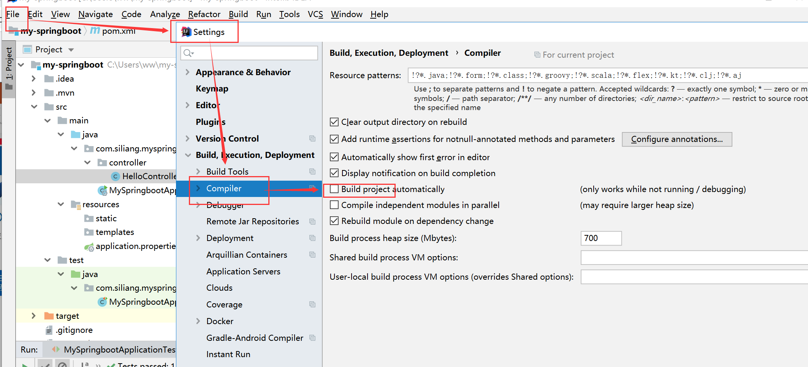
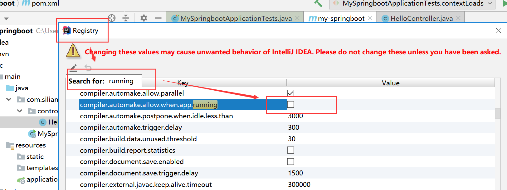

# 实操


## pom文件钟添加spring-boot-devtools热部署依赖


```xml
        <dependency>
            <groupId>org.springframework.boot</groupId>
            <artifactId>spring-boot-devtools</artifactId>
        </dependency>
```


## idea中热部署设置


**第1步**




**第2步**

ctrl+shift+alt(option)+/   打开界面





## 热部署测试


使用浏览器测试，不需要重复启动main方法