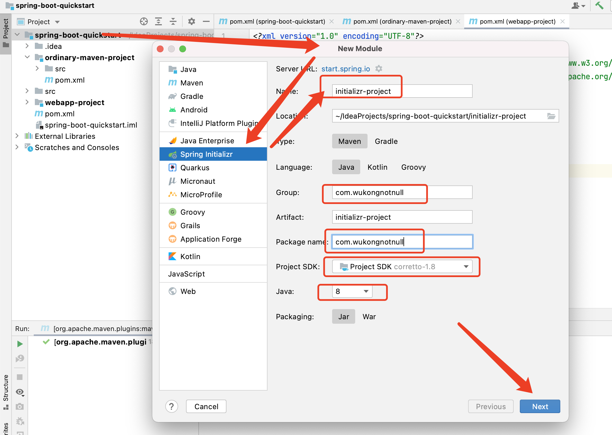
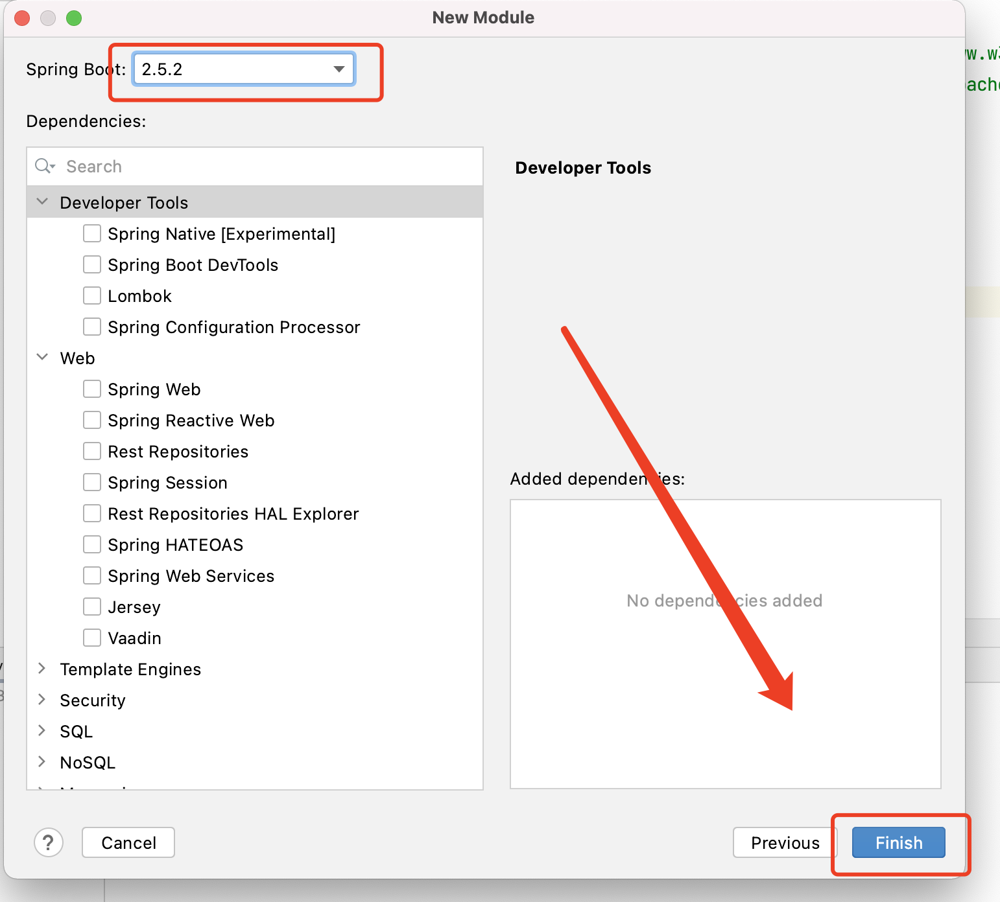
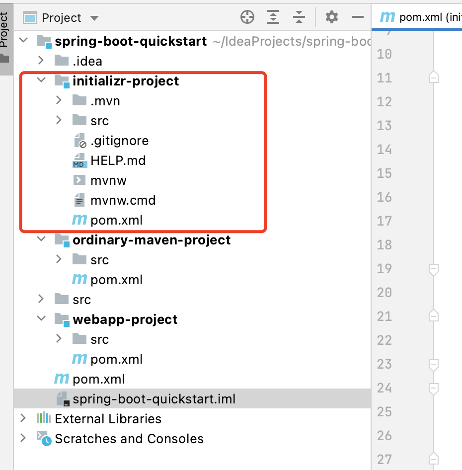

## 悟空编号

`sbqt001`

<br>

## 配套视频

> B 站链接：

<br>

##  使用Spring Initialzr方式构建 Spring Boot 项目


> - 推荐：建议创建父子项目，而不是单体项目
>
> - 推荐： 使用阿里 Maven 镜像构建项目，速度快
>
>   - 打开 maven 的配置文件  **conf/settings.xml**，在 `<mirrors></mirrors>` 标签中添加 mirror 子节点:
>
>     ```xml
>     <mirror>
>       <id>aliyunmaven</id>
>       <mirrorOf>*</mirrorOf>
>       <name>阿里云公共仓库</name>
>       <url>https://maven.aliyun.com/repository/public</url>
>     </mirror>
>     ```


### 创建父项目


### 创建子项目

第 1 步




第 2 步




第 3 步

检查目录结构是否完整

> .mvn  HELP.md  mvnw   mvnw.cmd 4 个文件（目录）可以直接删除




