# maven构建Spring Boot项目


## Mac OS 版


> - 推荐：创建父子项目
>
> - 推荐： 使用阿里 Maven 镜像构建项目，速度快
>
>   - 打开 maven 的配置文件  **conf/settings.xml**，在 `<mirrors></mirrors>` 标签中添加 mirror 子节点:
>
>     ```xml
>     <mirror>
>       <id>aliyunmaven</id>
>       <mirrorOf>*</mirrorOf>
>       <name>阿里云公共仓库</name>
>       <url>https://maven.aliyun.com/repository/public</url>
>     </mirror>
>     ```


 ## 创建父项目

第 1 步  父项目不要勾选  `create from archetype`

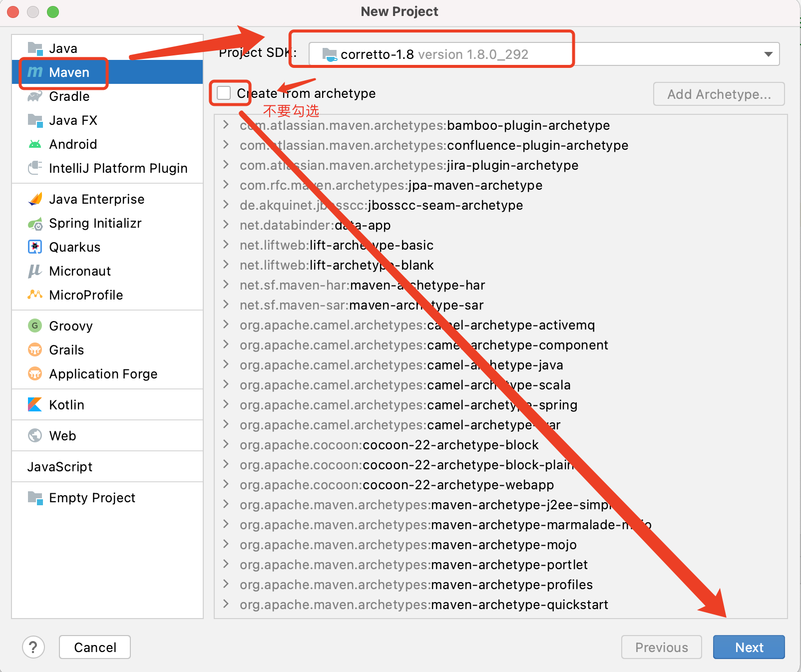


第 2 步

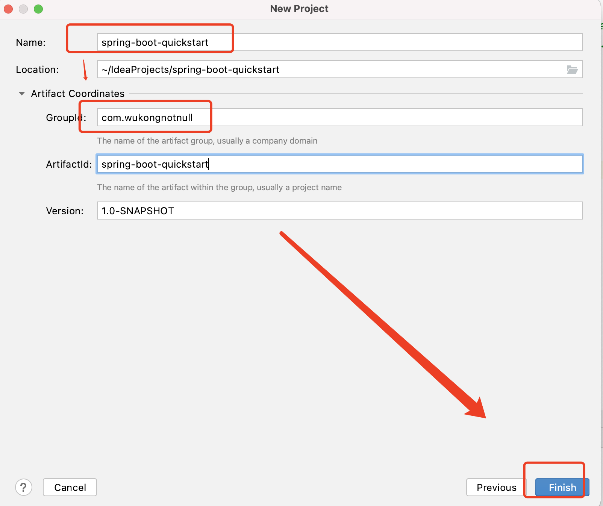


### 创建普通 Java 子项目

第 3 步  举例：

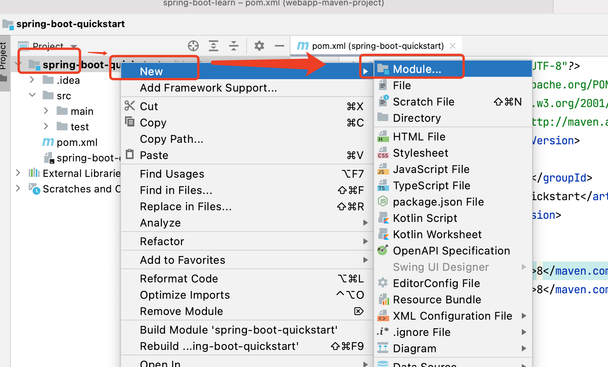


第 4 步 

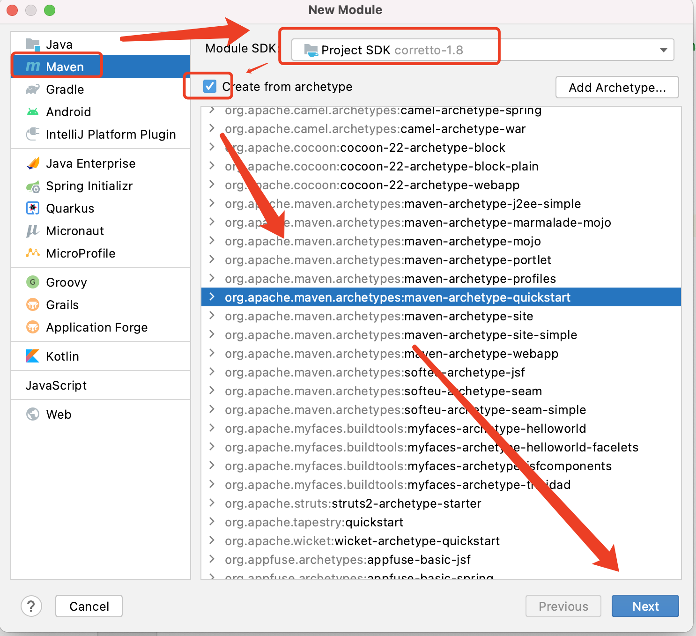


第 5 步   

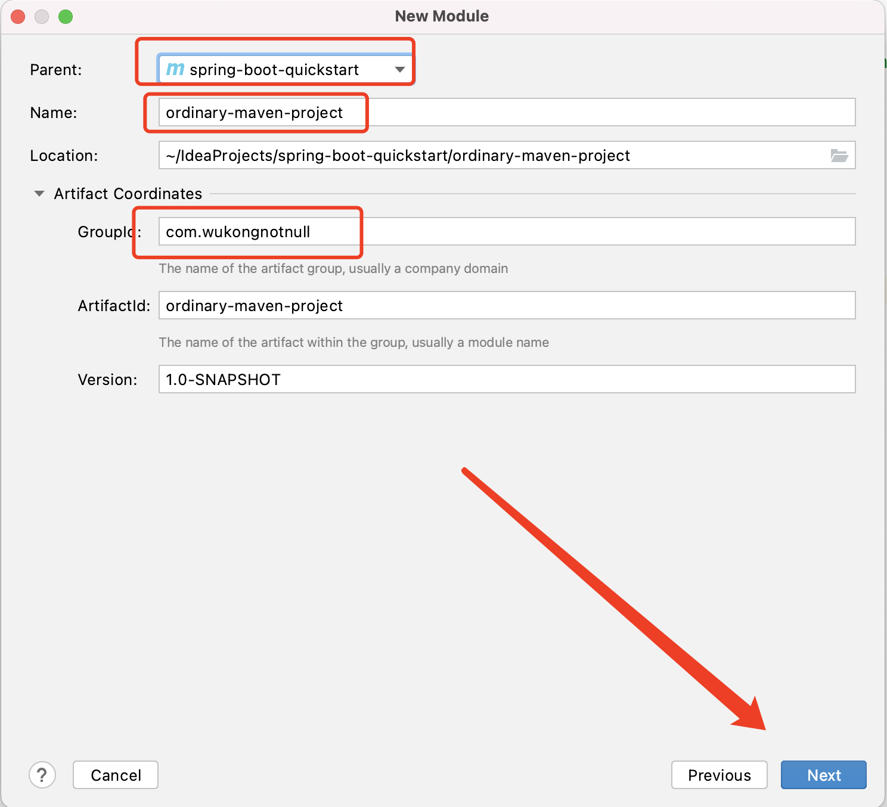


第 6 步

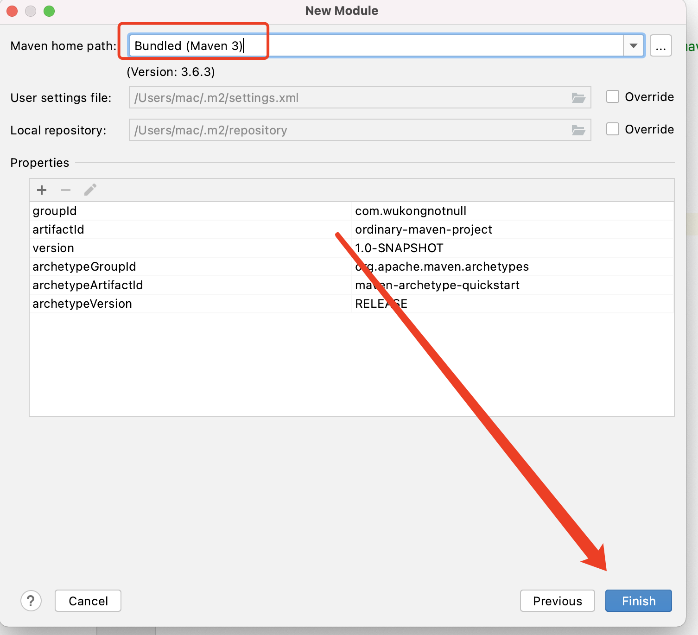


### 添加 spring boot 依赖


在 `pom.xml` 中

```xml
    <parent>
        <groupId>org.springframework.boot</groupId>
        <artifactId>spring-boot-starter-parent</artifactId>
        <version>2.5.2</version>
        <relativePath/> <!-- lookup parent from repository -->
    </parent>


    <dependencies>
        <dependency>
            <groupId>org.springframework.boot</groupId>
            <artifactId>spring-boot-starter</artifactId>
        </dependency>

        <dependency>
            <groupId>org.springframework.boot</groupId>
            <artifactId>spring-boot-starter-test</artifactId>
            <scope>test</scope>
        </dependency>
    </dependencies>


```


### 创建 Web Maven 子项目


第 1 步

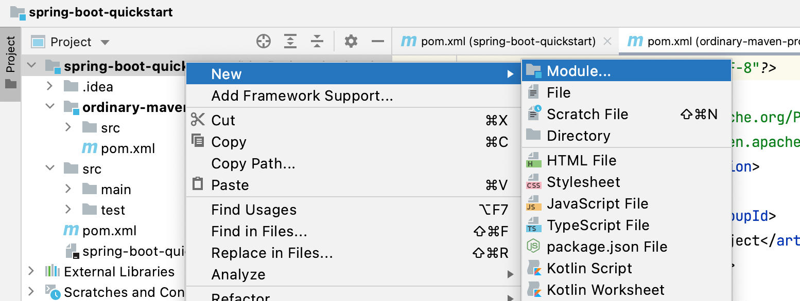


第 2 步

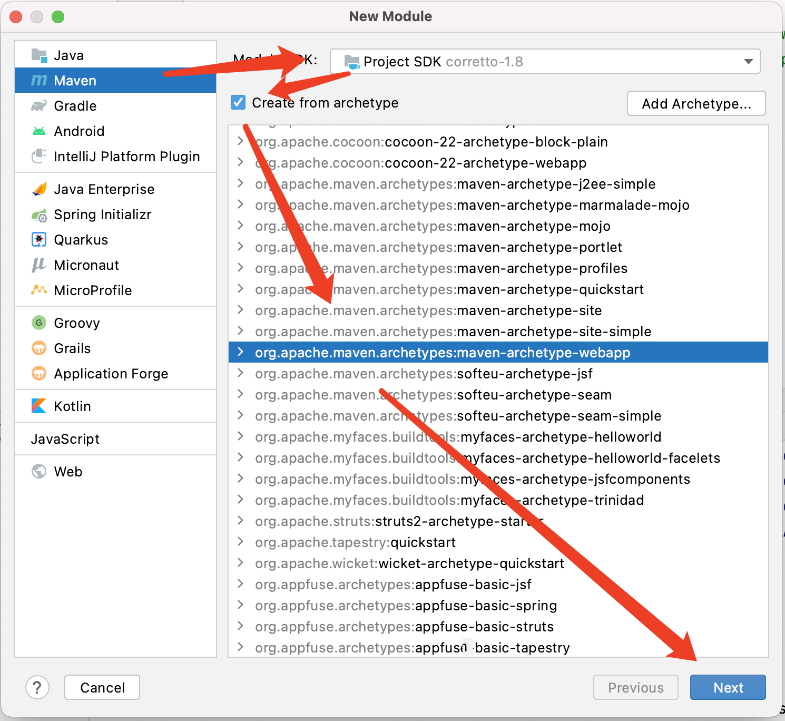


第 3 步

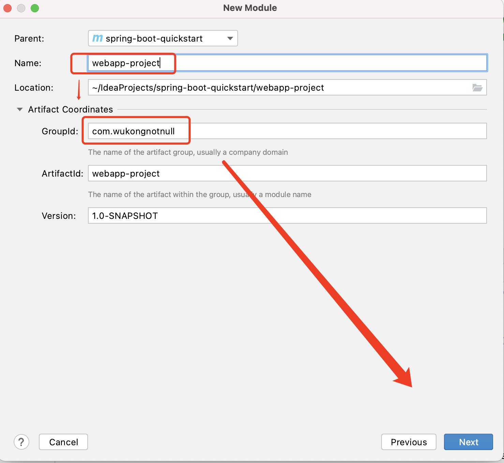


第 4 步

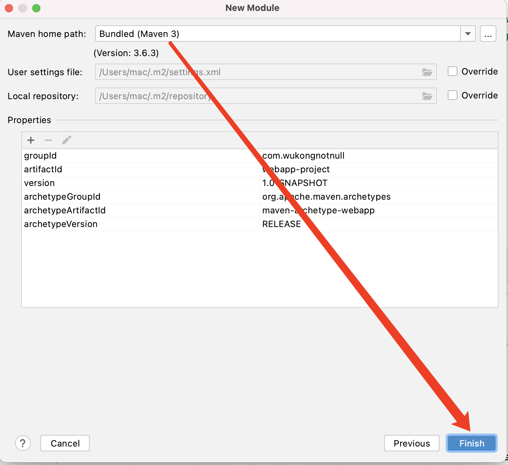


最后，检查生成的目录结构是否完整

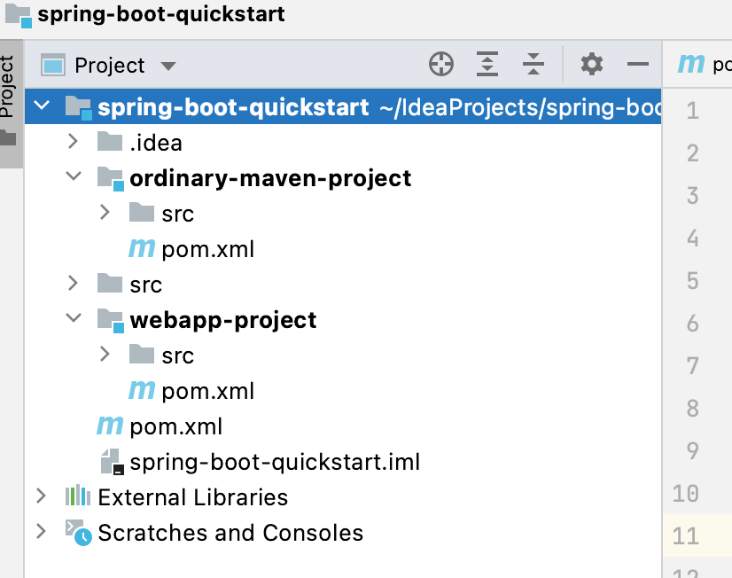


### 添加 spring boot 依赖


在 `pom.xml` 中

```xml
    <parent>
        <groupId>org.springframework.boot</groupId>
        <artifactId>spring-boot-starter-parent</artifactId>
        <version>2.5.2</version>
        <relativePath/> <!-- lookup parent from repository -->
    </parent>


    <dependencies>
        <dependency>
            <groupId>org.springframework.boot</groupId>
            <artifactId>spring-boot-starter</artifactId>
        </dependency>

        <dependency>
            <groupId>org.springframework.boot</groupId>
            <artifactId>spring-boot-starter-test</artifactId>
            <scope>test</scope>
        </dependency>
    </dependencies>


```


# 作业


- 使用 Maven 创建单项目
- 使用 Maven 创建父子项目，子项目为普通Java项目 或者为 Web 项目