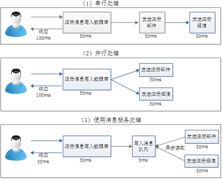
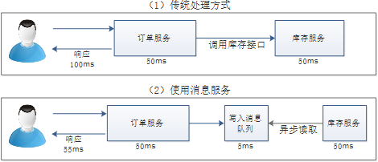
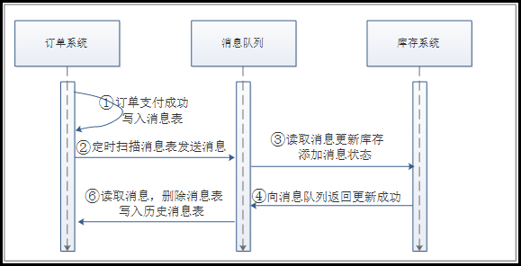

# 为什么要使用消息服务

 在多数应用尤其是分布式系统中，消息服务是不可或缺的重要部分，它使用起来比较简单，同时解决了不少难题，例如异步处理、应用解耦、流量削锋、分布式事务管理等，使用消息服务可以实现一个高性能、高可用、高扩展的系统。

 

**异步处理**

 

**应用解耦**

 

**流量削峰**

 

**分布式事务**

1.订单支付成功后，写入消息表 

2.定时扫描消息表消息写入到消息队列中 

3.库存系统会立即读取到消息队列中的消息进行库存更新，同时添加消息处理状态 

4.库存系统向消息队列中写入库存处理结果 

5.订单系统会立即读取到消息队列中的库存处理状态。直接删除消息表数据，并写入到历史消息表 

# 常用消息中间件介绍

 

 

 

