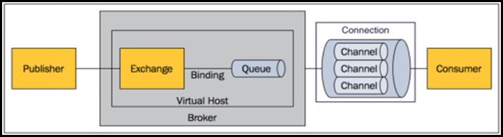
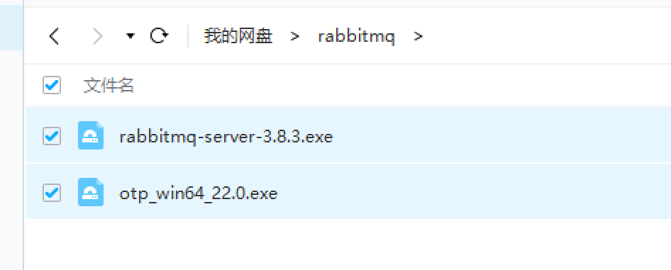
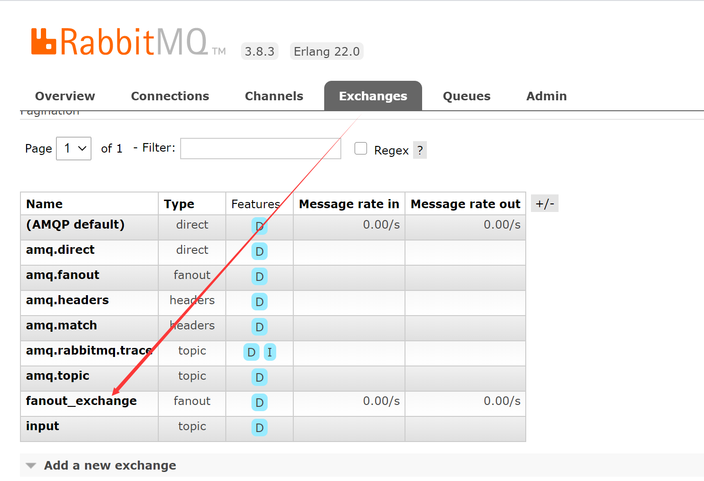
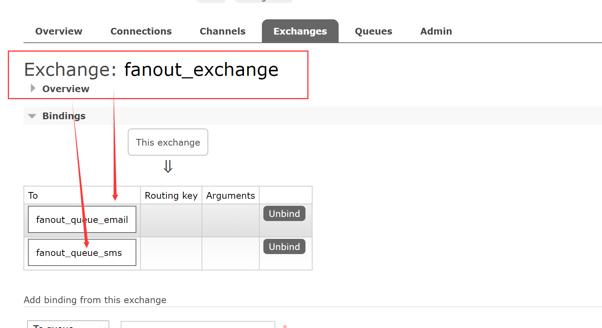
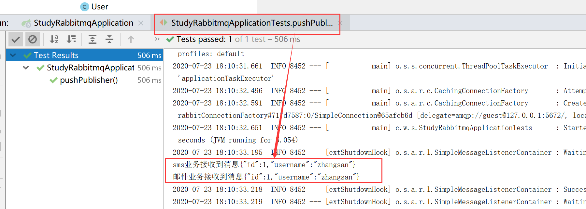
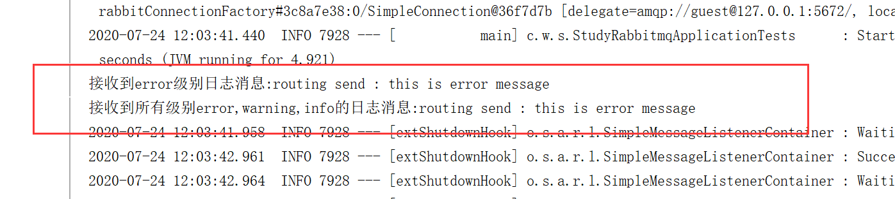
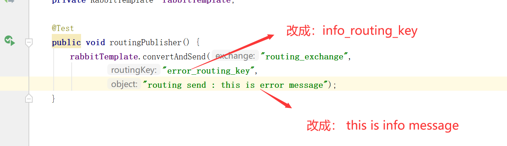

# RabbitMQ 消息中间件



**工作模式介绍**

•Work queues（工作队列模式）

•Publish/Subscribe（发布订阅模式）

•Routing（路由模式）

•Topics（通配符模式）

•RPC

•Headers（使用较少，不进行详细介绍）

## 8.4 安装RabbitMQ

**注意版本的兼容，3.8版本需要20以上的，不然不兼容，注意**




1、在RabbitMQ官网上http://www.rabbitmq.com/install-windows.html

下载,如果是在Windows环境下安装RabbitMQ消息中间件还需要64位的Erlang语言包支持。

2、 RabbitMQ安装包依赖于Erlang语言包的支持，所以要先安装Erlang语言包，再安装RabbitMQ安装包。

3、RabbitMQ可视化效果展示, RabbitMQ默认提供了两个端口号5672和15672，其中5672用作服务端口号，15672用作可视化管理端口号。在浏览器上访问http://localhost:15672(用户名和密码均为guest)


## 8.5 Spring Boot整合RabbitMQ环境搭建

1-pom

```xml
  <dependency>
            <groupId>org.springframework.boot</groupId>
            <artifactId>spring-boot-starter-amqp</artifactId>
        </dependency>
        <dependency>
            <groupId>org.springframework.boot</groupId>
            <artifactId>spring-boot-starter-web</artifactId>
        </dependency>
```

2-application.properties

```properties
#连接rabbitmq服务器
spring.rabbitmq.host=localhost
spring.rabbitmq.port=5672
spring.rabbitmq.username=guest
spring.rabbitmq.password=guest
#配置rabbitmq虚拟主机路径 / ，默认可以省略
spring.rabbitmq.virtual-host=/
```


## 8.6 Public/Subscribe发布/订阅工作模式

1-基于api方式

1.1 交换器和队列进行绑定

```java
 @Autowired
    private AmqpAdmin amqpAdmin;
@Test
    public void amqpAdmin(){
        //定义fanout类型交换器
        amqpAdmin.declareExchange(new FanoutExchange("fanout_exchange"));
        //定义2个默认持久化队列，处理email和sms
        amqpAdmin.declareQueue(new Queue("fanout_queue_email"));
        amqpAdmin.declareQueue(new Queue("fanout_queue_sms"));
        //将队列分别与交换机进行绑定
        amqpAdmin.declareBinding(new Binding("fanout_queue_email",
                Binding.DestinationType.QUEUE,"fanout_exchange","",null));
        amqpAdmin.declareBinding(new Binding("fanout_queue_sms",Binding.DestinationType.QUEUE,
                "fanout_exchange","",null));
```






1.2  消息发布者发布消息

**先创建实体类，同时将实体类输出格式转换成json格式**

```java
package com.wukongnotnull.studyrabbitmq.domain;


public class User  {

    private  Integer id;
    private  String username;

    public Integer getId() {
        return id;
    }

    public void setId(Integer id) {
        this.id = id;
    }

    public String getUsername() {
        return username;
    }

    public void setUsername(String username) {
        this.username = username;
    }


}

```

```java
package com.wukongnotnull.studyrabbitmq.config;

import org.springframework.amqp.support.converter.Jackson2JsonMessageConverter;
import org.springframework.amqp.support.converter.MessageConverter;
import org.springframework.context.annotation.Bean;
import org.springframework.context.annotation.Configuration;

@Configuration
public class RabbitMQConfig {

    //将实体类转换成json格式呈现
    @Bean
    public MessageConverter messageConverter(){
        return new Jackson2JsonMessageConverter();
    }

}

```


**消息发布者**

```java
 

    @Autowired
    private RabbitTemplate  rabbitTemplate;
    @Test
    public void pushPublisher(){
        User user = new User();
        user.setId(1);
        user.setUsername("zhangsan");
        rabbitTemplate.convertAndSend("fanout_exchange","",user);
    }
```


1.3 消息消费者消费消息

```java
package com.wukongnotnull.studyrabbitmq.service;

import org.springframework.amqp.core.Message;
import org.springframework.amqp.rabbit.annotation.RabbitListener;
import org.springframework.stereotype.Service;

@Service
public class RabbitMQService {

    @RabbitListener(queues = "fanout_queue_email")
    public void pushConsumerEmail(Message message){
        byte[] bytes = message.getBody();
        String string = new String(bytes);
        System.out.println("邮件业务接收到消息"+string);

    }

    @RabbitListener(queues = "fanout_queue_sms")
    public void pushConsumerSMS(Message message){
        byte[] bytes = message.getBody();
        String string = new String(bytes);
        System.out.println("sms业务接收到消息"+string);
    }
}

```


1.4 测试




**2-基于配置类的方式**


**1**、打开RabbitMQ消息配置类**RabbitMQConfig**，定义消息转换器、**fanout**类型的交换器、不同名称的消息队列以及将不同名称的消息队列与交换器绑定。

```java
package com.wukongnotnull.studyrabbitmq.config;

import org.springframework.amqp.core.*;
import org.springframework.amqp.support.converter.Jackson2JsonMessageConverter;
import org.springframework.amqp.support.converter.MessageConverter;
import org.springframework.context.annotation.Bean;
import org.springframework.context.annotation.Configuration;

@Configuration
public class RabbitMQConfig {

    //将实体类转换成json格式呈现
    @Bean
    public MessageConverter messageConverter(){
        return new Jackson2JsonMessageConverter();
    }
    //创建 fanout类型的交换器
    @Bean
    public Exchange fanout_exchange(){
        return ExchangeBuilder.fanoutExchange("fanout_exchange").build();
    }

    //创建 存放email消息的持久化队列
    @Bean
    public Queue fanout_queue_email(){
        return new Queue("fanout_queue_email");
    }

    //创建存放 sms 消息的持久化队列
    @Bean
    public Queue fanout_queue_sms(){
        return new Queue("fanout_queue_sms");
    }
    //创建存放 weixin 消息的持久化队列
    @Bean
    public Queue fanout_queue_wx(){
        return new Queue("fanout_queue_wx");
    }
    //email消息队列绑定交换机
    @Bean
    public Binding bindingEmail(){
        return
                BindingBuilder.bind(fanout_queue_email()).to(fanout_exchange()).with("").noargs();
    }
    //sms消息队列绑定交换机
    @Bean
    public Binding bindingSms(){
        return
                BindingBuilder.bind(fanout_queue_sms()).to(fanout_exchange()).with("").noargs();
    }

    //wx消息队列绑定交换机
    @Bean
    public Binding bindingWx(){
        return
                BindingBuilder.bind(fanout_queue_wx()).to(fanout_exchange()).with("").noargs();
    }

}

```


3-基于注解方式实现 发布/订阅模式

```java
package com.wukongnotnull.studyrabbitmq.service;

import com.wukongnotnull.studyrabbitmq.domain.User;
import org.springframework.amqp.rabbit.annotation.Exchange;
import org.springframework.amqp.rabbit.annotation.Queue;
import org.springframework.amqp.rabbit.annotation.QueueBinding;
import org.springframework.amqp.rabbit.annotation.RabbitListener;
import org.springframework.stereotype.Service;

@Service
public class RabbitMQService {

    @RabbitListener(bindings =@QueueBinding(value = @Queue("fanout_queue_email"), exchange = @Exchange(value = "fanout_exchange",type = "fanout")))
    public void psubConsumerEmailAno(User user) {
        System.out.println("邮件业务接收到消息： "+user);
    }


    @RabbitListener(bindings =@QueueBinding(value =
    @Queue("fanout_queue_sms"),exchange =
    @Exchange(value = "fanout_exchange",type = "fanout")))
    public void psubConsumerSmsAno(User user) {
        System.out.println("短信业务接收到消息： "+user);
    }
}
```


## 8.7 Routing路由工作模式

1.使用基于注解的方式定制消息组件和消息消费者


**打开业务类**RabbitMQService，在该类中使用**@**RabbitListener**注解及其相关属性定制**Routing路由模式的消息组件，并模拟编写消息消费者接收的方法。

```java
package com.wukongnotnull.studyrabbitmq.service;

import org.springframework.amqp.rabbit.annotation.Exchange;
import org.springframework.amqp.rabbit.annotation.Queue;
import org.springframework.amqp.rabbit.annotation.QueueBinding;
import org.springframework.amqp.rabbit.annotation.RabbitListener;
import org.springframework.stereotype.Service;

@Service
public class RabbitMQService {

    @RabbitListener(
            bindings = @QueueBinding(
                    value = @Queue(value = "routing_queue_error"),
                    exchange =@Exchange(
                            value = "routing_exchange",
                            type = "direct"
                    ) ,
                    key = "error_routing_key"
            )
    )
    public  void routingConsumerError(String message){
        System.out.println("接收到error级别日志消息:"+message);
    }

    @RabbitListener(
            bindings = @QueueBinding(
                    value = @Queue(value = "routing_queue_all"),
                    exchange = @Exchange(
                            value = "routing_exchange",
                            type = "direct"
                    ),
                    key = {"error_routing_key","warning_routing_key","info_routing_key"}
            )
    )
    public void routingConsumerAll(String message){
        System.out.println("接收到所有级别error,warning,info的日志消息:"+message);
    }
}
```


2.**消息发送者**发送消息

```java
      @Autowired
    private RabbitTemplate  rabbitTemplate;

    @Test
    public void routingPublisher() {
        rabbitTemplate.convertAndSend("routing_exchange",
                "error_routing_key",
                "routing send : this is error message");
    }
```


3-测试结果




4-改造：



5-测试结果为：


## 8.8 Topics通配符工作模式

“通配符交换机”（Topic Exchange）将路由键和某模式进行匹配。此时队列需要绑定在一个模式上。符号“#”匹配一个或多个词，符号“*”仅匹配一个词。因此“audit.#”能够匹配到“audit.irs.corporate”，但是“audit.*”只会匹配到“audit.irs”。（这里与我们一般的正则表达式的“*”和“#”刚好相反，这里我们需要注意一下。）
举例：

key:

info.#.email.#  的队列  ---》邮件业务订阅该队列的消息
info.#.sms.#    的队列   ---》短信业务订阅该队列的消息

routingKey:

info.email  
info.sms
info.email.sms

1-使用注解方式定制消息组件和消息订阅者（消费者）

```java
package com.wukongnotnull.studyrabbitmq.service;

import org.springframework.amqp.rabbit.annotation.Exchange;
import org.springframework.amqp.rabbit.annotation.Queue;
import org.springframework.amqp.rabbit.annotation.QueueBinding;
import org.springframework.amqp.rabbit.annotation.RabbitListener;
import org.springframework.stereotype.Service;

@Service
public class RabbitMQService {

    @RabbitListener(
            bindings = @QueueBinding(
                    value = @Queue(value = "topic_queue_email"),
                    exchange =@Exchange(value = "topic_exchange",type = "topic") ,
                    key = "info.#.email.#"

    ))
    public void topicConsumerEmail(String message){
        System.out.println("邮件业务消费该消息："+message);
    }

    @RabbitListener(
            bindings = @QueueBinding(
                    value = @Queue(value = "topic_queue_sms"),
                    exchange = @Exchange(value = "topic_exchange",type = "topic"),
                    key = "info.#.sms.#"
            )
    )
    public void topicConsumerSMS(String message){
        System.out.println("短信业务消费该消息："+message);
    }
}
```

2-消息发送者发送消息

```java
    @Autowired
    private RabbitTemplate  rabbitTemplate;

    @Test
    public void topicPublisher(){
        //只发邮件
      //  rabbitTemplate.convertAndSend("topic_exchange","info.email","email: this is an email");
        //只发短信
       // rabbitTemplate.convertAndSend("topic_exchange","info.sms","sms: this is a sms");
        //既发邮件也发短信
        rabbitTemplate.convertAndSend("topic_exchange","info.email.sms","both: we are an email and a sms");
    }
```

# 

