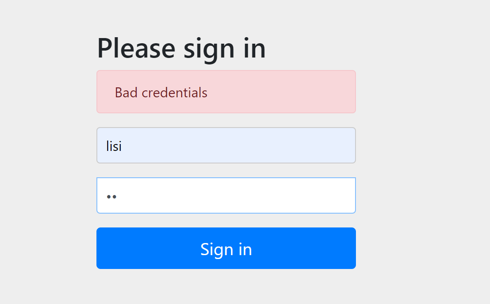

# 内存身份认证

> 自定义用户名和密码，该方法适用于测试环境，临时使用


```java
package com.wukongnotnull.config;

import org.springframework.security.config.annotation.authentication.builders.AuthenticationManagerBuilder;
import org.springframework.security.config.annotation.authentication.configurers.provisioning.InMemoryUserDetailsManagerConfigurer;
import org.springframework.security.config.annotation.web.configuration.EnableWebSecurity;
import org.springframework.security.config.annotation.web.configuration.WebSecurityConfigurerAdapter;
import org.springframework.security.crypto.bcrypt.BCryptPasswordEncoder;

//author: 悟空非空也（B站/知乎/公众号）
@EnableWebSecurity
public class SecurityConfig  extends WebSecurityConfigurerAdapter {
    
    @Override
    protected void configure(AuthenticationManagerBuilder auth) throws Exception {
        //设置密码编码器
        BCryptPasswordEncoder bCryptPasswordEncoder = new BCryptPasswordEncoder();

        // 内存身份认证，模拟测试用户
        InMemoryUserDetailsManagerConfigurer<AuthenticationManagerBuilder> builder =
                auth.inMemoryAuthentication().passwordEncoder(bCryptPasswordEncoder);

        builder.withUser("wukong").password(bCryptPasswordEncoder.encode("wukong")).roles("common");
        builder.withUser("admin").password(bCryptPasswordEncoder.encode("admin")).roles("vip");
    }

}

```

<br>


# JDBC 身份认证

**sql 脚本**

```sql
#use database
USE springbootdata;
#create t_customer 并插入相关数据
DROP TABLE IF EXISTS `t_customer`;
CREATE TABLE t_customer (
	`id` INT(20) NOT NULL AUTO_INCREMENT PRIMARY KEY,
	username VARCHAR(200),
	`password` VARCHAR(200),
	`valid` TINYINT(1) NOT NULL DEFAULT '1'
);
INSERT INTO t_customer VALUES(
	'1','wukong','wukong','1'
),(
	'2','admin','admin','1'
);

#创建表 t_authority 并插入数据
DROP TABLE IF EXISTS `t_authority`;
CREATE TABLE `t_authority`(
	id INT(20) NOT NULL AUTO_INCREMENT PRIMARY KEY,
	authority VARCHAR(20)
);
INSERT INTO `t_authority` VALUES(
	1,'ROLE_common'
),(2,'ROLE_vip');

#创建中间表 t_customer_authority，并插入数据
DROP TABLE IF EXISTS `t_customer_authority`;
CREATE TABLE `t_customer_authority`(
	id INT(20) NOT NULL AUTO_INCREMENT PRIMARY KEY,
	customer_id INT(20),
	authority_id INT(20)
);
INSERT INTO `t_customer_authority` VALUES(
	'1','1','1'
),(
	'2','2','2'
);

```

<br>

**配置mysql连接和redis连接**

```xml
# MySQL
spring.datasource.url=jdbc:mysql://localhost:3306/springbootdata?serverTimezone=UTC
spring.datasource.username=root
spring.datasource.password=root

spring.thymeleaf.cache=false
```

<br>

**添加依赖**

```xml
       <!--jdbc数据库连接启动器-->
        <dependency>
            <groupId>org.springframework.boot</groupId>
            <artifactId>spring-boot-starter-jdbc</artifactId>
        </dependency>
        <!--mysql 数据库连接驱动-->
        <dependency>
            <groupId>mysql</groupId>
            <artifactId>mysql-connector-java</artifactId>
        </dependency>
```

<br>

**编写安全配置类**

```java
package com.wukong.config;

import org.springframework.beans.factory.annotation.Autowired;
import org.springframework.security.config.annotation.authentication.builders.AuthenticationManagerBuilder;
import org.springframework.security.config.annotation.authentication.configurers.provisioning.InMemoryUserDetailsManagerConfigurer;
import org.springframework.security.config.annotation.web.configuration.EnableWebSecurity;
import org.springframework.security.config.annotation.web.configuration.WebSecurityConfigurerAdapter;
import org.springframework.security.crypto.bcrypt.BCryptPasswordEncoder;

import javax.sql.DataSource;

@EnableWebSecurity
public class SecurityConfig extends WebSecurityConfigurerAdapter {

    @Autowired
    private DataSource dataSource;

    //重写 configure方法
    @Override
    protected void configure(AuthenticationManagerBuilder auth) throws Exception {
        //设置密码编码器
        BCryptPasswordEncoder bCryptPasswordEncoder = new BCryptPasswordEncoder();

        //使用jdbc进行身份认证
        String userSQL ="select username,password,valid from t_customer " +
                   "where username = ?";
           String authoritySQL="select c.username,a.authority from t_customer c,t_authority a,"+
                   "t_customer_authority ca where ca.customer_id=c.id " +
                   "and ca.authority_id=a.id and c.username =?";
           auth.jdbcAuthentication().passwordEncoder(bCryptPasswordEncoder)
                   .dataSource(dataSource)
                   .usersByUsernameQuery(userSQL)
                   .authoritiesByUsernameQuery(authoritySQL);

    }
}

```

<br>


**登录测试**

> 1   对密码进行编码加密
>
> ```java
> @Test
> void contextLoads() {
>     //设置密码编码器
>     BCryptPasswordEncoder bCryptPasswordEncoder = new BCryptPasswordEncoder();
>     String wukong = bCryptPasswordEncoder.encode("wukong");
>     String admin = bCryptPasswordEncoder.encode("admin");
>     System.out.println("wukong = " + wukong);
>     System.out.println("admin = " + admin);
>     System.out.println("是否编码成功？---> " + bCryptPasswordEncoder.matches("wukong", wukong));
> }
> ```
>
> 2  生成的密码保存到数据库中





<br>


# UserDetailService 身份认证

**pom.xml**

```java

        <!--redis-->
        <dependency>
            <groupId>org.springframework.boot</groupId>
            <artifactId>spring-boot-starter-data-redis</artifactId>
        </dependency>
        <!-- Spring Data JPA操作数据库  -->
        <dependency>
            <groupId>org.springframework.boot</groupId>
            <artifactId>spring-boot-starter-data-jpa</artifactId>
        </dependency>

        <!--mysql 数据库连接驱动-->
        <dependency>
            <groupId>mysql</groupId>
            <artifactId>mysql-connector-java</artifactId>
            <scope>runtime</scope>
        </dependency>
        <!--启动安全管理-->
        <dependency>
            <groupId>org.springframework.boot</groupId>
            <artifactId>spring-boot-starter-security</artifactId>
        </dependency>

        <dependency>
            <groupId>org.springframework.boot</groupId>
            <artifactId>spring-boot-starter-web</artifactId>
        </dependency>
```

<br>

**domain:**

**Authority**

```java
package com.wukongnotnull.domain;

import javax.persistence.Entity;
import javax.persistence.GeneratedValue;
import javax.persistence.GenerationType;
import javax.persistence.Id;
import java.io.Serializable;

@Entity(name = "t_authority")
public class Authority implements Serializable {
    @Id
    @GeneratedValue(strategy = GenerationType.IDENTITY)
    private  Integer id;
    private  String authority;

    public Integer getId() {
        return id;
    }

    public void setId(Integer id) {
        this.id = id;
    }

    public String getAuthority() {
        return authority;
    }

    public void setAuthority(String authority) {
        this.authority = authority;
    }

    @Override
    public String toString() {
        return "Authority{" +
                "id=" + id +
                ", authority='" + authority + '\'' +
                '}';
    }
}

```

<br>

**Customer**

```java
package com.wukongnotnull.domain;

import javax.persistence.Entity;
import javax.persistence.GeneratedValue;
import javax.persistence.GenerationType;
import javax.persistence.Id;
import java.io.Serializable;
@Entity(name = "t_customer")
public class Customer implements  Serializable {
    @Id
    @GeneratedValue(strategy = GenerationType.IDENTITY)
    private  Integer id;
    private  String username;
    private  String password;
    private  Integer valid;

    public Integer getValid() {
        return valid;
    }

    public void setValid(Integer valid) {
        this.valid = valid;
    }
    public Integer getId() {
        return id;
    }

    public void setId(Integer id) {
        this.id = id;
    }

    public String getUsername() {
        return username;
    }

    public void setUsername(String username) {
        this.username = username;
    }

    public String getPassword() {
        return password;
    }

    public void setPassword(String password) {
        this.password = password;
    }
}

```

<br>

**repository: AuthorityRepository**

```java
package com.wukongnotnull.repository;

import com.wukong.domain.Authority;
import org.springframework.data.jpa.repository.JpaRepository;
import org.springframework.data.jpa.repository.Query;

import java.util.List;

public interface AuthorityRepository extends JpaRepository<Authority,Integer> {
  
    @Query(value = "select a.* from t_customer c,t_authority a,t_customer_authority ca where ca.customer_id=c.id and ca.authority_id=a.id and c.username =?1",nativeQuery = true)
    public List<Authority> findAuthoritiesByUsername(String username);
  
}

```

<br>

**CustomerRepository**

```java
package com.wukong.repository;

import com.wukong.domain.Customer;
import org.springframework.data.jpa.repository.JpaRepository;

public interface CustomerRepository extends JpaRepository<Customer,Integer> {

    Customer findByUsername(String username);


}

```

<br>

**service:**

**CustomerService**

```java
package com.wukongnotnull.service;
//author: 悟空非空也（B站/知乎/公众号）

import com.wukongnotnull.domain.Customer;

public interface CustomerService {

    // 根据用户名查询用户信息
    Customer findByUsername(String username);
}

```

<br>

**AuthorityService**

```
package com.wukongnotnull.service;
//author: 悟空非空也（B站/知乎/公众号）

import com.wukongnotnull.domain.Authority;

import java.util.List;

public interface AuthorityService {

    public List<Authority> findAuthoritiesByUsername(String username);
}
```

<br>

**CustomerServiceImpl**

```java
package com.wukongnotnull.service;
//author: 悟空非空也（B站/知乎/公众号）

import com.wukongnotnull.dao.CustomerRepository;
import com.wukongnotnull.domain.Customer;
import org.springframework.beans.factory.annotation.Autowired;
import org.springframework.data.redis.core.RedisTemplate;
import org.springframework.stereotype.Service;

@Service
public class CustomerServiceImpl implements  CustomerService{

    @Autowired
    private CustomerRepository customerRepository;
    @Autowired
    private RedisTemplate redisTemplate;

    // 整合redis缓存,根据用户名查询用户信息
   public Customer findByUsername(String username){
       Customer customer=null;
       Object o = redisTemplate.opsForValue().get("customer_"+username);
       if(o!=null){
           customer=(Customer)o;
       }else {
           customer = customerRepository.findByUsername(username);
           if(customer!=null){
               redisTemplate.opsForValue().set("customer_"+username,customer);
           }
       }
       return customer;
    }

}
```

<br>

**AuthorityServiceImpl**

```java
package com.wukongnotnull.service;
//author: 悟空非空也（B站/知乎/公众号）

import com.wukongnotnull.dao.AuthorityRepository;
import com.wukongnotnull.domain.Authority;
import org.springframework.beans.factory.annotation.Autowired;
import org.springframework.data.redis.core.RedisTemplate;
import org.springframework.stereotype.Service;

import java.util.List;
@Service
public class AuthorityServiceImpl implements AuthorityService{
    @Autowired
    private AuthorityRepository authorityRepository;
    @Autowired
    private RedisTemplate redisTemplate;

    // 整合 redis 缓存，根据唯一用户名查询权限列表
    public List<Authority> findAuthoritiesByUsername(String username){
        List<Authority> authorities=null;
        Object o = redisTemplate.opsForValue().get("authorities_" + username);
        if(o!=null){
            authorities=(List<Authority>) o;
        }else {
            authorities=authorityRepository.findAuthoritiesByUsername(username);
            if(authorities.size()>0){
                redisTemplate.opsForValue().set("authorities_"+username,authorities);
            }
        }
        return authorities;
    }

}
```

<br>

**UserDetailsServiceImpl**

```java
package com.wukongnotnull.service;
//author: 悟空非空也（B站/知乎/公众号）

import com.wukongnotnull.domain.Authority;
import com.wukongnotnull.domain.Customer;
import lombok.Data;
import org.springframework.beans.factory.annotation.Autowired;
import org.springframework.security.core.authority.SimpleGrantedAuthority;
import org.springframework.security.core.userdetails.User;
import org.springframework.security.core.userdetails.UserDetails;
import org.springframework.security.core.userdetails.UserDetailsService;
import org.springframework.security.core.userdetails.UsernameNotFoundException;
import org.springframework.stereotype.Service;

import java.util.List;
import java.util.stream.Collectors;

@Service
public class UserDetailsServiceImpl implements UserDetailsService {

    @Autowired
    private CustomerService customerService;
    @Autowired
    private AuthorityService authorityService;


    /**
     * Locates the user based on the username. In the actual implementation, the search
     * may possibly be case sensitive, or case insensitive depending on how the
     * implementation instance is configured. In this case, the <code>UserDetails</code>
     * object that comes back may have a username that is of a different case than what
     * was actually requested..
     *
     * @param username the username identifying the user whose data is required.
     * @return a fully populated user record (never <code>null</code>)
     * @throws UsernameNotFoundException if the user could not be found or the user has no
     *                                   GrantedAuthority
     */
    @Override
    public UserDetails loadUserByUsername(String username) throws UsernameNotFoundException {
        //通过业务方法获取用户及权限信息
        Customer customer = customerService.findByUsername(username);

        List<Authority> authorities = authorityService.findAuthoritiesByUsername(username);
        // 对用户权限进行封装
        List<SimpleGrantedAuthority> authorityList = authorities.stream().
                map(authority -> new SimpleGrantedAuthority(authority.getAuthority()))
                .collect(Collectors.toList());

        // 返回封装的UserDetails用户详情类
        if(customer!=null){
            // 同名用户存在，那么密码是否一致呢？
            UserDetails userDetails= new User(customer.getUsername(),customer.getPassword(),authorityList);
            return userDetails;
        } else {
            // 如果查询的用户不存在（用户名不存在），必须抛出此异常
            throw new UsernameNotFoundException("当前用户不存在！");
        }

    }
}
```

<br>

**SecurityConfig**

> 使用Springboot集合Springsecurity的时候，报了一个java.lang.IllegalArgumentException: There is no PasswordEncoder
>
> **原因**
>
> security 1.5.0以上的版本，增加多种的加密方式，为了增加安全，要求将密码通过加密算法处理过后才存入数据库。
>
> 客户端传递过来的明文密码需要加密后，和数据库中的暗文进行对比，实现身份验证。


```
package com.wukongnotnull.config;

import org.springframework.beans.factory.annotation.Autowired;
import org.springframework.security.config.annotation.authentication.builders.AuthenticationManagerBuilder;
import org.springframework.security.config.annotation.web.configuration.EnableWebSecurity;
import org.springframework.security.config.annotation.web.configuration.WebSecurityConfigurerAdapter;
import org.springframework.security.core.userdetails.UserDetailsService;
import org.springframework.security.crypto.bcrypt.BCryptPasswordEncoder;

//author: 悟空非空也（B站/知乎/公众号）
@EnableWebSecurity
public class SecurityConfig  extends WebSecurityConfigurerAdapter {
    @Autowired
    private UserDetailsService userDetailsService;

    @Override
    protected void configure(AuthenticationManagerBuilder auth) throws Exception {

        //设置密码编码器
        BCryptPasswordEncoder bCryptPasswordEncoder = new BCryptPasswordEncoder();

        //使用 UserDetailsService 进行身份认证时，对明文密码进行加密
        auth.userDetailsService(userDetailsService).passwordEncoder(bCryptPasswordEncoder);

    }

}
```

<br>


**登录测试**

> | 用户名 | 密码   |
> | ------ | ------ |
> | wukong | wukong |
> | admin  | admin  |


