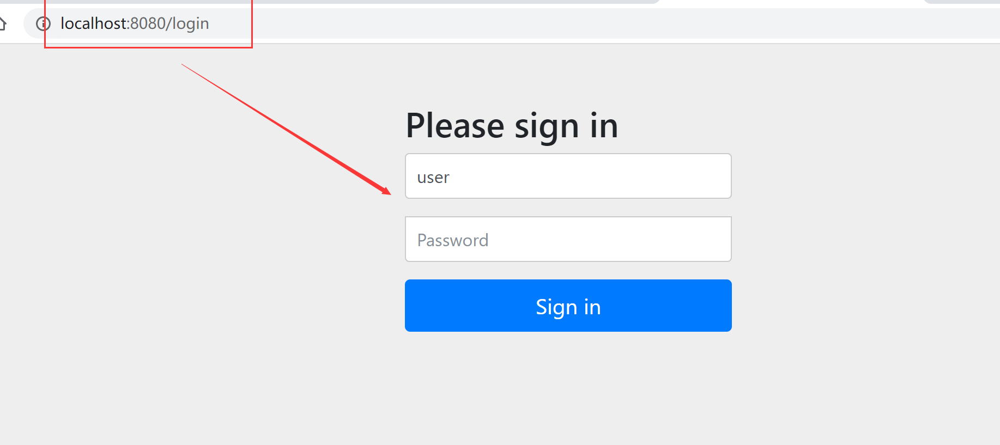

# SpringSecurity介绍


# Spring Security 快速入门


**pom.xml**

```xml
 <dependency>
            <groupId>org.springframework.boot</groupId>
            <artifactId>spring-boot-starter-security</artifactId>
        </dependency>

        <dependency>
            <groupId>org.springframework.boot</groupId>
            <artifactId>spring-boot-starter-thymeleaf</artifactId>
        </dependency>
        <dependency>
            <groupId>org.springframework.boot</groupId>
            <artifactId>spring-boot-starter-web</artifactId>
        </dependency>
```

<br>


**直接url访问**

>默认显示 登录界面，该界面是由spring security提供的
>用户名  user
>密码   启动项目时候，在控制台随机生成




<br>


## Mvc Security 安全配置介绍


