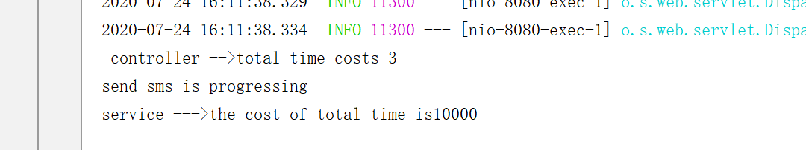
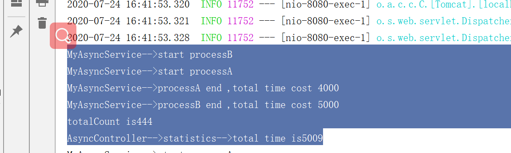

## 无返回值异步任务调用


1-application.java

```java
@EnableAsync  //support async annotation
@SpringBootApplication
public class AsynChapter9Application {
```


2-service

```java
package com.wukongnotnull.asynchapter9.service;

import org.springframework.scheduling.annotation.Async;
import org.springframework.stereotype.Service;

@Service
public class MyAsyncService {

    @Async
    public void sendSMS(){
        System.out.println("send sms is progressing");
        long startTime = System.currentTimeMillis();
        try {
            Thread.sleep(10000);
        } catch (InterruptedException e) {
            e.printStackTrace();
        }
        long endTime = System.currentTimeMillis();
        System.out.println("service --->the cost of total time is"+(endTime-startTime));
    }


}
```


3-controller

```java
@RestController
public class AsyncController {

    @Autowired
    private MyAsyncService myAsyncService;

    @RequestMapping("/sendSMS")
    public String sendSMS(){
        long startTime = System.currentTimeMillis();
        myAsyncService.sendSMS();
        long endTime = System.currentTimeMillis();
        System.out.println(" controller -->total time costs "+(endTime-startTime));
        return "sms has been sent, wait for 10 seconds";
    }

}
```


4-test




## 9.2 有返回值异步任务调用


1-sevice

```java
@Service
public class MyAsyncService {

    @Async
    public Future<Integer> processA(){
        System.out.println("MyAsyncService-->start processA");
        long startTime = System.currentTimeMillis();
        try {
            Thread.sleep(4000);
        } catch (InterruptedException e) {
            e.printStackTrace();
        }
        int count=123;
        long endTime = System.currentTimeMillis();
        System.out.println("MyAsyncService-->processA end ,total time cost "+(endTime-startTime));
        return new AsyncResult<Integer>(count);
    }

    @Async
    public Future<Integer> processB(){
        System.out.println("MyAsyncService-->start processB");
        long startTime = System.currentTimeMillis();
        try {
            Thread.sleep(5000);
        } catch (InterruptedException e) {
            e.printStackTrace();
        }
        int count=321;
        long endTime = System.currentTimeMillis();
        System.out.println("MyAsyncService-->processB end ,total time cost "+(endTime-startTime));
        return new AsyncResult<Integer>(count);
    }

```


2-controller

```java
 @RequestMapping("/statistics")
    public String statistics(){
        long startTime = System.currentTimeMillis();
        Future<Integer> processA = myAsyncService.processA();
        Future<Integer> processB = myAsyncService.processB();
        try {
            Integer totalCount=processA.get()+processB.get();
            System.out.println("totalCount is"+totalCount);
        } catch (Exception e) {
            e.printStackTrace();
        }
        long endTime = System.currentTimeMillis();
        System.out.println("AsyncController-->statistics-->total time is"+(endTime-startTime));
        return "success";
    }
```


3-test




**所谓异步就是2个方法同时执行**

上述异步方法是有返回值的，这样主流程在执行异步方法时会有短暂阻塞，需要等待并获取异步方法的返回结果，而调用的两个异步方法会作为两个子线程并行执行，直到异步方法执行完成并返回结果，这样主流程会在最后一个异步方法返回结果后跳出阻塞状态。