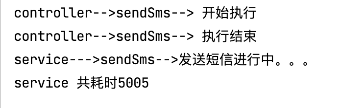
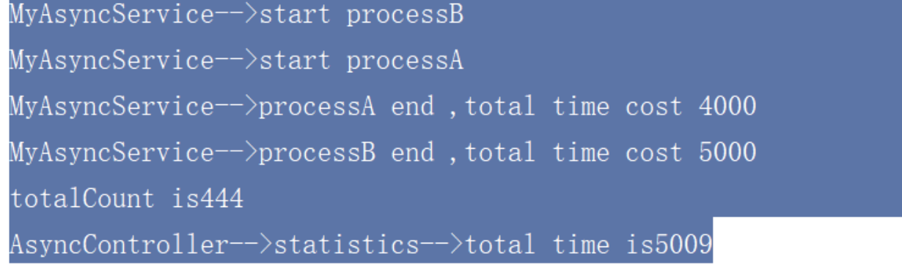

# 无返回值异步任务调用

>  应用场景： 发送注册验证码


```xml
        <dependency>
            <groupId>org.springframework.boot</groupId>
            <artifactId>spring-boot-starter-web</artifactId>
        </dependency>
```

<br>


**1-application.java**

```java
package com.wukongnotnull;

import org.springframework.boot.SpringApplication;
import org.springframework.boot.autoconfigure.SpringBootApplication;
import org.springframework.scheduling.annotation.EnableAsync;

@EnableAsync
@SpringBootApplication
public class SbTaskApplication {

    public static void main(String[] args) {
        SpringApplication.run(SbTaskApplication.class, args);
    }

}

```

<br>

**2-service**

```java
package com.wukongnotnull.service;
//author: 悟空非空也（B站/知乎/公众号）

public interface MyAsyncService  {
    public void sendSms();

}

package com.wukongnotnull.service;
//author: 悟空非空也（B站/知乎/公众号）

import org.springframework.scheduling.annotation.Async;
import org.springframework.stereotype.Service;

@Service
public class MyAsyncServiceImpl implements  MyAsyncService{

    @Async
    public void sendSms(){
        long startTime = System.currentTimeMillis();
        System.out.println("service--->sendSms-->发送短信进行中。。。");
        try {
            Thread.sleep(5000);
        }catch (Exception e){
            e.printStackTrace();
        }
        long endTime = System.currentTimeMillis();
        System.out.println("service 共耗时"+(endTime-startTime));

    }
}

```

<br>

**3-controller**

```java
package com.wukongnotnull.controller;
//author: 悟空非空也（B站/知乎/公众号）

import com.wukongnotnull.service.MyAsyncService;
import org.springframework.beans.factory.annotation.Autowired;
import org.springframework.web.bind.annotation.GetMapping;
import org.springframework.web.bind.annotation.RestController;

@RestController
public class MyAsyncController {

    @Autowired
    private MyAsyncService myAsyncService;

    @GetMapping("/sendsms")
    public String sendSms(){
        System.out.println("controller-->sendSms--> 开始执行");
        myAsyncService.sendSms();
        System.out.println("controller-->sendSms--> 执行结束");
        return "短信验证码已发送，请稍后查收";
    }


}

```

<br>

**4-test**




<br>

# 有返回值异步任务调用

> 2个方法 processA() 和 processB()  同时执行，不是先后执行


**1-sevice**

```java
@Service
public class MyAsyncService {

    @Async
    public Future<Integer> processA(){
        System.out.println("MyAsyncService-->start processA");
        long startTime = System.currentTimeMillis();
        try {
            Thread.sleep(4000);
        } catch (InterruptedException e) {
            e.printStackTrace();
        }
        int count=123;
        long endTime = System.currentTimeMillis();
        System.out.println("MyAsyncService-->processA end ,total time cost "+(endTime-startTime));
        return new AsyncResult<Integer>(count);
    }

    @Async
    public Future<Integer> processB(){
        System.out.println("MyAsyncService-->start processB");
        long startTime = System.currentTimeMillis();
        try {
            Thread.sleep(5000);
        } catch (InterruptedException e) {
            e.printStackTrace();
        }
        int count=321;
        long endTime = System.currentTimeMillis();
        System.out.println("MyAsyncService-->processB end ,total time cost "+(endTime-startTime));
        return new AsyncResult<Integer>(count);
    }

```

<br>

**2-controller**

```java
 @RequestMapping("/statistics")
    public String statistics(){
        long startTime = System.currentTimeMillis();
        Future<Integer> processA = myAsyncService.processA();
        Future<Integer> processB = myAsyncService.processB();
        try {
            Integer totalCount=processA.get()+processB.get();
            System.out.println("totalCount is"+totalCount);
        } catch (Exception e) {
            e.printStackTrace();
        }
        long endTime = System.currentTimeMillis();
        System.out.println("AsyncController-->statistics-->total time is"+(endTime-startTime));
        return "success";
    }
```

<br>

**3-test**



<br>

**所谓异步就是2个方法同时执行**

上述异步方法是有返回值的，这样主流程在执行异步方法时会有短暂阻塞，需要等待并获取异步方法的返回结果，而调用的两个异步方法会作为两个子线程并行执行，直到异步方法执行完成并返回结果，这样主流程会在最后一个异步方法返回结果后跳出阻塞状态。