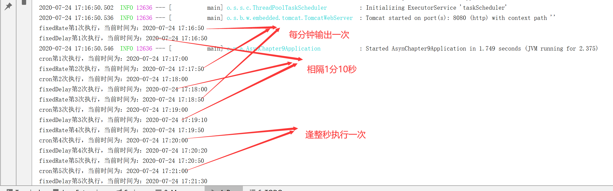

# 定时任务介绍

**@Scheduled注解**


https://www.jianshu.com/p/1defb0f22ed1


# 定时任务实现

**新建定时业务处理类 ScheduledTaskService**


> 该类中编写定时任务处理方法使用 @Scheduled 注解声明了三个定时任务方法，
>
> 定制的执行规则基本相同，都是每隔1分钟重复执行一次定时任务
>
> 在使用 fixedDelay 属性的方法 scheduledTaskAfterSleep() 中，使用 Thread.sleep(10000 )模拟该定时任务处理耗时为10秒钟。


<br>

**启动类**

```java
@EnableScheduling
@SpringBootApplication
public class SbTaskApplication {

    public static void main(String[] args) {
        SpringApplication.run(SbTaskApplication.class, args);
    }

}
```


<br>

**service**

```java
@Service
public class ScheduledTaskService {

    private static final SimpleDateFormat dateFormat = new SimpleDateFormat("yyyy-MM-dd HH:mm:ss");
    private Integer count1 = 1;
    private Integer count2 = 1;
    private Integer count3 = 1;


    //每隔1分钟，执行一次
    @Scheduled(fixedRate = 60000)
    public void scheduledTaskImmediately() {
        System.out.println(String.format("fixedRate第%s次执行，当前时间为：%s",
                count1++, dateFormat.format(new Date())));
    }
    //每隔1分10秒（1分钟定时+业务处理时间10秒），执行一次
    @Scheduled(fixedDelay = 60000)
    public void scheduledTaskAfterSleep() throws InterruptedException {
        System.out.println(String.format("fixedDelay第%s次执行，当前时间为：%s",
                count2++, dateFormat.format(new Date())));
        Thread.sleep(10000);//模拟业务处理时间
    }
    //整秒输出
    @Scheduled(cron = "0 * * * * *")
    public void scheduledTaskCron(){
        System.out.println(String.format("cron第%s次执行，当前时间为：%s",
                count3++, dateFormat.format(new Date())));
    }


}
```

<br>


**启动启动类测试**



