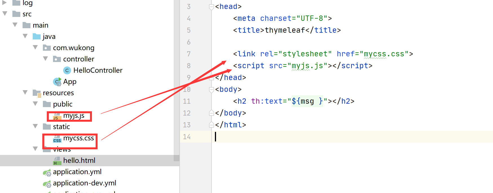

## 访问静态资源

在resources 目录下创建static 或者public 存放images、js、css等静态资源文件 .

这样的静态资源可以通过网址直接访问到。

http://localhost:8080/wukong/mycss.css

http://localhost:8080/wukong/myjs.js

同时，

也可以分别被引入到html页面中





**自定静态资源存放位置**

可以存在 src/main/resources/static/  

或者src/main/resources/public/ 

或者 src/main/resources/wukong/ 

```yaml
spring:
  web:
    resources:
      static-locations: classpath:/static/,classpath:/public/,classpath:/wukong/

```

