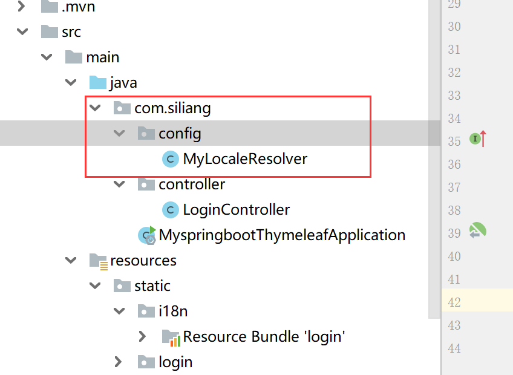
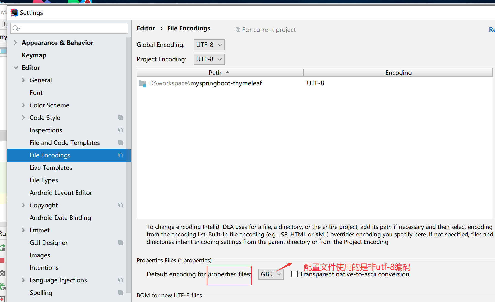

## Thymeleaf常用标签


##  Thymeleaf 标准表达式


## Thymeleaf 基本使用


创建springboot项目


```xml
 <dependencies>

        <!--thymeleaf依赖-->
        <dependency>
            <groupId>org.springframework.boot</groupId>
            <artifactId>spring-boot-starter-thymeleaf</artifactId>
        </dependency>

        <!--web项目依赖-->
        <dependency>
            <groupId>org.springframework.boot</groupId>
            <artifactId>spring-boot-starter-web</artifactId>
        </dependency>
</dependencies>

```

配置thymeleaf模板缓存application.properties

```xml
#模板缓存
spring.thymeleaf.cache=true
#模板编码
spring.thymeleaf.encoding=UTF-8
#模板样式
spring.thymeleaf.mode=HTML5
#指定模板存放路径
spring.thymeleaf.prefix=classpath:/templates/
#指定模板页面的后缀
spring.thymeleaf.suffix=.html
```


## 4.5 使用Thymeleaf 完成数据的页面展示

```properites
#模板缓存改成false，上线后改成true
spring.thymeleaf.cache=false
```

controller

```java
package com.siliang.controller;

import org.springframework.stereotype.Controller;
import org.springframework.ui.Model;
import org.springframework.web.bind.annotation.RequestMapping;

import java.util.Calendar;

@Controller
public class LoginController {
    @RequestMapping(value = "/login")
    public String login(Model model){
        int currentYear = Calendar.getInstance().get(Calendar.YEAR);
        model.addAttribute("currentYear",currentYear);
        return "login";
    }
}
```


login.html

```html
<!DOCTYPE html>
<html lang="en" xmlns:th="http://www.thymeleaf.org">
<head>
    <meta http-equiv="Content-Type" content="text/html; charset=UTF-8">
    <meta name="viewport" content="width=device-width, initial-scale=1,shrink-to-fit=no">
    <title>用户登录界面</title>
    <link th:href="@{/login/css/bootstrap.min.css}" rel="stylesheet">
    <link th:href="@{/login/css/signin.css}" rel="stylesheet">
</head>
<body class="text-center">
<!--  用户登录form表单 -->
<form class="form-signin">
    
    <h1 class="h3 mb-3 font-weight-normal" th:text="#{login.tip}">请登录</h1>
    <input type="text" class="form-control"
           th:placeholder="#{login.username}" required="" autofocus="">
    <input type="password" class="form-control"
           th:placeholder="#{login.password}" required="">
    <div class="checkbox mb-3">
        <label>
            <input type="checkbox" value="remember-me"> [[#{login.rememberme}]]
        </label>
    </div>
    <button class="btn btn-lg btn-primary btn-block" type="submit" th:text="#{login.button}">登录</button>
    <p class="mt-5 mb-3 text-muted">© <span th:text="${currentYear}">2018</span>-<span th:text="${currentYear}+1">2019</span></p>
    <a class="btn btn-sm" th:href="@{/toLoginPage(l='zh_CN')}">中文</a>
    <a class="btn btn-sm" th:href="@{/toLoginPage(l='en_US')}">English</a>
</form>
</body>
</html>

```


## 4.6 使用Thymeleaf配置国际化页面


login.properties

```properties
login.tip=请登录
login.username=用户名
login.password=密码
login.rememberme=记住我
login.button=登录
```

login_zh_CN.properties

```properties
login.tip=请登录
login.username=用户名
login.password=密码
login.rememberme=记住我
login.button=登录
```

login_en_US.properties

```properties
login.tip=Please sign in
login.username=Username
login.password=Password
login.rememberme=Remember me
login.button=Login
```

在application.properties中配置国际化文件的基础名

```properties
#配置国际化文件基础名
spring.messages.basename=i18n.login
```

定制区域化解析器


```java
package com.wukongnotnull.config;
import org.springframework.context.annotation.Bean;
import org.springframework.context.annotation.Configuration;
import org.springframework.lang.Nullable;
import org.springframework.util.StringUtils;
import org.springframework.web.servlet.LocaleResolver;

import javax.servlet.http.HttpServletRequest;
import javax.servlet.http.HttpServletResponse;
import java.util.Locale;

@Configuration
public class MyLocaleResolver implements LocaleResolver {
    // 自定义区域解析方式
    @Override
    public Locale resolveLocale(HttpServletRequest httpServletRequest) {
        // 获取页面手动切换传递的语言参数l
        String l = httpServletRequest.getParameter("l");
        // 获取请求头自动传递的语言参数Accept-Language
        String header = httpServletRequest.getHeader("Accept-Language");
        Locale locale=null;
        // 如果手动切换参数不为空，就根据手动参数进行语言切换，否则默认根据请求头信息切换
        if(!StringUtils.isEmpty(l)){
            String[] split = l.split("_");
            locale=new Locale(split[0],split[1]);
        }else {
            // Accept-Language: en-US,en;q=0.9,zh-CN;q=0.8,zh;q=0.7
            String[] splits = header.split(",");
            String[] split = splits[0].split("-");
            locale=new Locale(split[0],split[1]);
        }
        return locale;
    }
    
    @Override
    public void setLocale(HttpServletRequest httpServletRequest, @Nullable
            HttpServletResponse httpServletResponse, @Nullable Locale locale) {
    }
    
    // 将自定义的MyLocaleResolver类重新注册为一个类型LocaleResolver的Bean组件
    @Bean
    public LocaleResolver localeResolver(){
        return new MyLocaleResolver();
    }
    
}
```

启动后，浏览器测试

**还是出现中文乱码**


**原因**



**解决方案**

最佳方案

在创建新项目前，将idea进行字符编码设置，这样保证项目和配置文件中的所有中文打字都是使用utf-8编码


