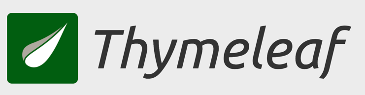
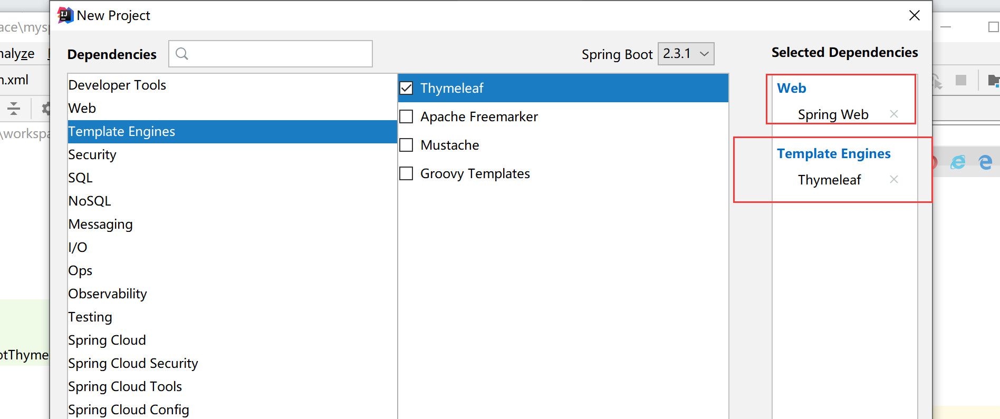
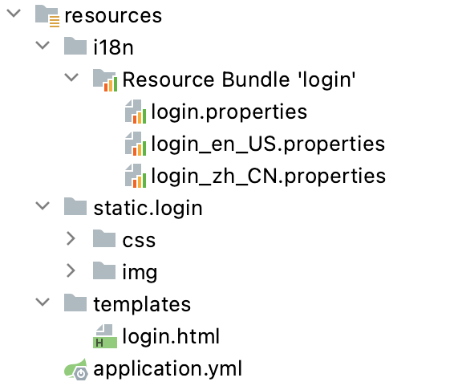
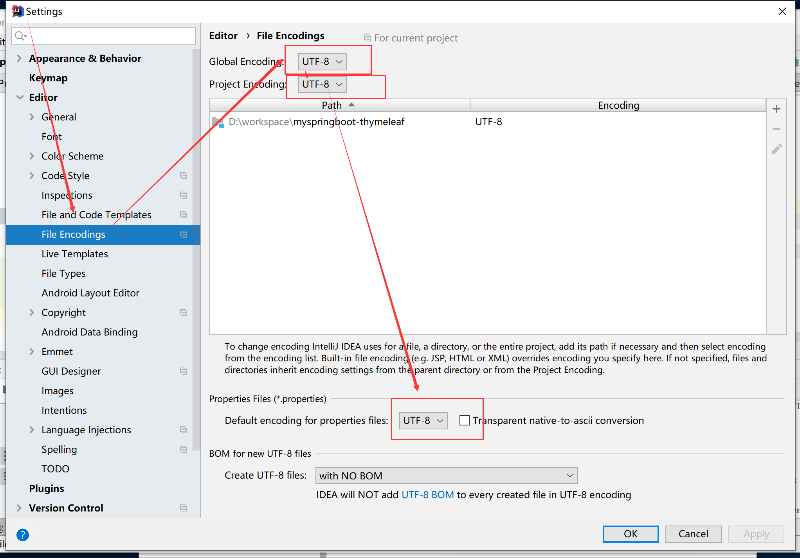

# Spring Boot 整合 Thymeleaf
## Thymeleaf 介绍

**Thymeleaf 官网**  
https://www.thymeleaf.org/index.html



Thymeleaf is a modern server-side Java template engine for both web and standalone environments.

Thymeleaf's main goal is to bring elegant natural templates to your development workflow — HTML that can be correctly displayed in browsers and also work as static prototypes, allowing for stronger collaboration in development teams.

With modules for Spring Framework, a host of integrations with your favourite tools, and the ability to plug in your own functionality, Thymeleaf is ideal for modern-day HTML5 JVM web development — although there is much more it can do.

Natural templates
HTML templates written in Thymeleaf still look and work like HTML, letting the actual templates that are run in your application keep working as useful design artifacts.

```html

<table>
  <thead>
    <tr>
      <th th:text="#{msgs.headers.name}">Name</th>
      <th th:text="#{msgs.headers.price}">Price</th>
    </tr>
  </thead>
  <tbody>
    <tr th:each="prod: ${allProducts}">
      <td th:text="${prod.name}">Oranges</td>
      <td th:text="${#numbers.formatDecimal(prod.price, 1, 2)}">0.99</td>
    </tr>
  </tbody>
</table>

```

<br>

**官网教学文档**  
https://www.thymeleaf.org/documentation.html


<br>

## Thymeleaf 常用标签


<br>

##  Thymeleaf 标准表达式

<br>

## 整合 Thymeleaf

<br>

**创建springboot项目**




<br>

```xml
 <dependencies>

        <!--thymeleaf依赖-->
        <dependency>
            <groupId>org.springframework.boot</groupId>
            <artifactId>spring-boot-starter-thymeleaf</artifactId>
        </dependency>

        <!--web项目依赖-->
        <dependency>
            <groupId>org.springframework.boot</groupId>
            <artifactId>spring-boot-starter-web</artifactId>
        </dependency>
</dependencies>

```

<br>


**application.yml 中配置 Thymeleaf 模板缓存 **

> 开发测试时，请关闭缓存。

```yaml

spring:
  thymeleaf:
    mode: HTML
    prefix: classpath:/templates/
    suffix: .html
    cache: false  # 关闭缓存
    encoding: UTF-8

    
```

<br>


##  使用 Thymeleaf 完成数据的页面展示

```yaml

```

<br>


## 使用Thymeleaf配置国际化页面


**前端资源目录结构**

> 前端资源下载链接
>
> https://share.weiyun.com/iVq52myH




<br>


**login.html**

```html
<!DOCTYPE html>
<html lang="en" xmlns:th="http://www.thymeleaf.org">
<head>
    <meta http-equiv="Content-Type" content="text/html; charset=UTF-8">
    <meta name="viewport" content="width=device-width, initial-scale=1,shrink-to-fit=no">
    <title>用户登录界面</title>
    <link th:href="@{/login/css/bootstrap.min.css}" rel="stylesheet">
    <link th:href="@{/login/css/signin.css}" rel="stylesheet">
</head>
<body class="text-center">

<form class="form-signin">
    
    <h1 class="h3 mb-3 font-weight-normal" th:text="#{login.tip}">请登录</h1>
    <input type="text" class="form-control"
           th:placeholder="#{login.username}" required="" autofocus="">
    <input type="password" class="form-control"
           th:placeholder="#{login.password}" required="">
    <div class="checkbox mb-3">
        <label>
            <input type="checkbox" value="remember-me"> [[#{login.rememberme}]]
        </label>
    </div>
    <button class="btn btn-lg btn-primary btn-block" type="submit" th:text="#{login.button}">登录</button>
    <p class="mt-5 mb-3 text-muted">© <span th:text="${currentYear}">2018</span>-<span th:text="${currentYear}+1">2019</span></p>
    <a class="btn btn-sm" th:href="@{/toLoginPage(l='zh_CN')}">中文</a>
    <a class="btn btn-sm" th:href="@{/toLoginPage(l='en_US')}">English</a>
</form>
</body>
</html>

```


<br>


**login.properties**

```properties
login.tip=请登录
login.username=用户名
login.password=密码
login.rememberme=记住我
login.button=登录
```

<br>

**login_zh_CN.properties**

```properties
login.tip=请登录
login.username=用户名
login.password=密码
login.rememberme=记住我
login.button=登录
```

<br>

**login_en_US.properties**

```properties
login.tip=Please sign in
login.username=Username
login.password=Password
login.rememberme=Remember me
login.button=Login
```


<br>

**在application.properties中配置国际化文件的基础名**

```properties
#配置国际化文件基础名
spring.messages.basename=i18n.login
```


<br>


**定制区域化解析器**

> 在  com.wukongnotnull.config 下创建 MyLocaleResolver 类

```java
package com.wukongnotnull.config;
import org.springframework.context.annotation.Bean;
import org.springframework.context.annotation.Configuration;
import org.springframework.lang.Nullable;
import org.springframework.util.StringUtils;
import org.springframework.web.servlet.LocaleResolver;

import javax.servlet.http.HttpServletRequest;
import javax.servlet.http.HttpServletResponse;
import java.util.Locale;

@Configuration
public class MyLocaleResolver implements LocaleResolver {
    // 自定义区域解析方式
    @Override
    public Locale resolveLocale(HttpServletRequest httpServletRequest) {
        // 获取页面手动切换传递的语言参数l
        String l = httpServletRequest.getParameter("l");
        // 获取请求头自动传递的语言参数Accept-Language
        String header = httpServletRequest.getHeader("Accept-Language");
        Locale locale=null;
        // 如果手动切换参数不为空，就根据手动参数进行语言切换，否则默认根据请求头信息切换
        if(!StringUtils.isEmpty(l)){
            String[] split = l.split("_");
            locale=new Locale(split[0],split[1]);
        }else {
            // Accept-Language: en-US,en;q=0.9,zh-CN;q=0.8,zh;q=0.7
            String[] splits = header.split(",");
            String[] split = splits[0].split("-");
            locale=new Locale(split[0],split[1]);
        }
        return locale;
    }

    @Override
    public void setLocale(HttpServletRequest httpServletRequest, @Nullable
            HttpServletResponse httpServletResponse, @Nullable Locale locale) {
    }

    // 将自定义的MyLocaleResolver类重新注册为一个类型LocaleResolver的Bean组件
    @Bean
    public LocaleResolver localeResolver(){
        return new MyLocaleResolver();
    }

}
```

<br>

**controller**

```java
package com.wukongnotnull.controller;
//author: 悟空非空也（B站/知乎/公众号）

import org.springframework.stereotype.Controller;
import org.springframework.ui.Model;
import org.springframework.web.bind.annotation.GetMapping;

import java.util.Calendar;

@Controller
public class IndexController {

    @GetMapping(value = "/login")
    public String login(){
        return "login";
    }

    @GetMapping(value = "/toLoginPage")
    public  String toLoginPage(Model model){
        int currentYear = Calendar.getInstance().get(Calendar.YEAR);
        model.addAttribute("currentYear",currentYear);
        return "login";
    }

}

```


**启动后，浏览器发送请求，进行测试**


## 中文乱码解决

> application 文件中出现中文乱码，请如下设置
>
> 在创建新项目前，将idea进行字符编码设置，这样保证项目和配置文件中的所有中文打字都是使用utf-8编码





<br><br><br>


