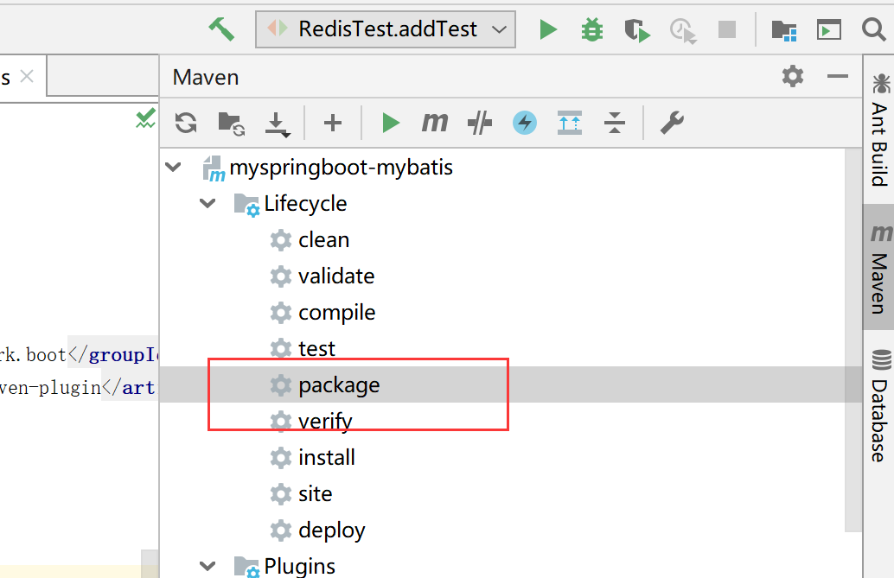
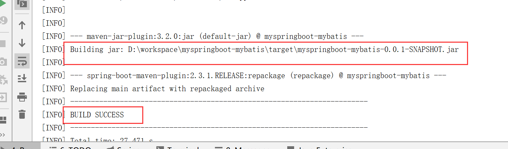

## jar包方式打包部署

**maven打包插件**

```xml
    <build>
        <plugins>
            <plugin>
                <groupId>org.springframework.boot</groupId>
                <artifactId>spring-boot-maven-plugin</artifactId>
            </plugin>
        </plugins>
    </build>
```

<br>

**点击package**



<br>


**保存路径**



<br>


**部署后就可以访问**

java -jar target\myspringboot-mybatis-0.0.1-SNAPSHOT.jar


<br>

**注意**

使用 java 指令，需要配置java的环境变量