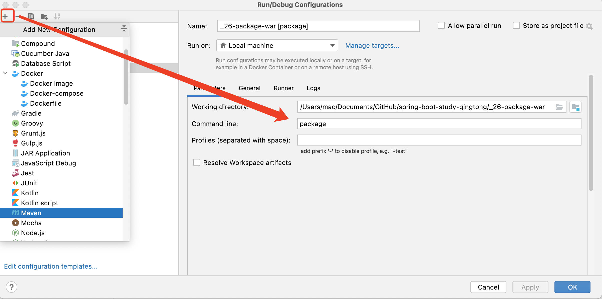
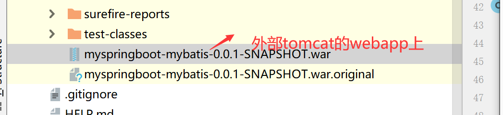
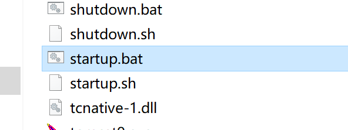

# Spring Boot  war包方式打包部署

## **pom.xml**

```xml
        <!-- jar 改成 war -->
				<packaging>war</packaging>


        <!-- 排除内嵌的 tomcat-->
        <dependency>
            <groupId>org.springframework.boot</groupId>
            <artifactId>spring-boot-starter-tomcat</artifactId>
            <scope>provided</scope>
        </dependency>

```

<br>


## **修改启动类**

```java
@SpringBootApplication
public class MyspringbootMybatisApplication extends SpringBootServletInitializer {

    //继承SpringbootServletInitializer ,重写configure方法
    protected SpringApplicationBuilder configure(SpringApplicationBuilder builder) {
        return builder.sources(MyspringbootMybatisApplication.class);
    }

    public static void main(String[] args) {
        SpringApplication.run(MyspringbootMybatisApplication.class, args);
    }

}

```

<br>


## **打包**

> 配置 maven 命令 进行打包 
>
> 操作 ： +   ->    Maven   ->  command Line: package





<br>


## **部署到外部的tomcat的webapp内**




<br>

## **启动tomcat部署成功**

> - 执行 `bin\startup.bat`指令
>
> - 执行启动指令后，`war` 包指定解压，生成同名文件夹 
> - 浏览器访问 http:// localhost:8080/[同名文件夹]




<br>

> **注意**
> Jar 包内嵌服务器（Tomcat），war包不含服务器，需要外部服务器才能运行


<br>
<br>

<br>