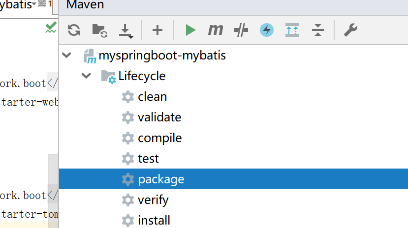

## war包方式打包部署

1

```xml
 <packaging>war</packaging>
```


1.2

```
<!--添加外部的tomcat-->

```


2

```java
@SpringBootApplication
public class MyspringbootMybatisApplication extends SpringBootServletInitializer {

    //继承SpringbootServletInitializer ,重写configure方法
    protected SpringApplicationBuilder configure(SpringApplicationBuilder builder) {
        return builder.sources(MyspringbootMybatisApplication.class);
    }

    public static void main(String[] args) {
        SpringApplication.run(MyspringbootMybatisApplication.class, args);
    }

}

```


3打包 




4部署到外部的tomcat的webapp内


5 启动tomcat，部署成功

bin\startup.bat指令


**注意**

一个既有前端又有后端的web项目，jar包不包含前端文件（jsp\html\css\img等），war包包含所有